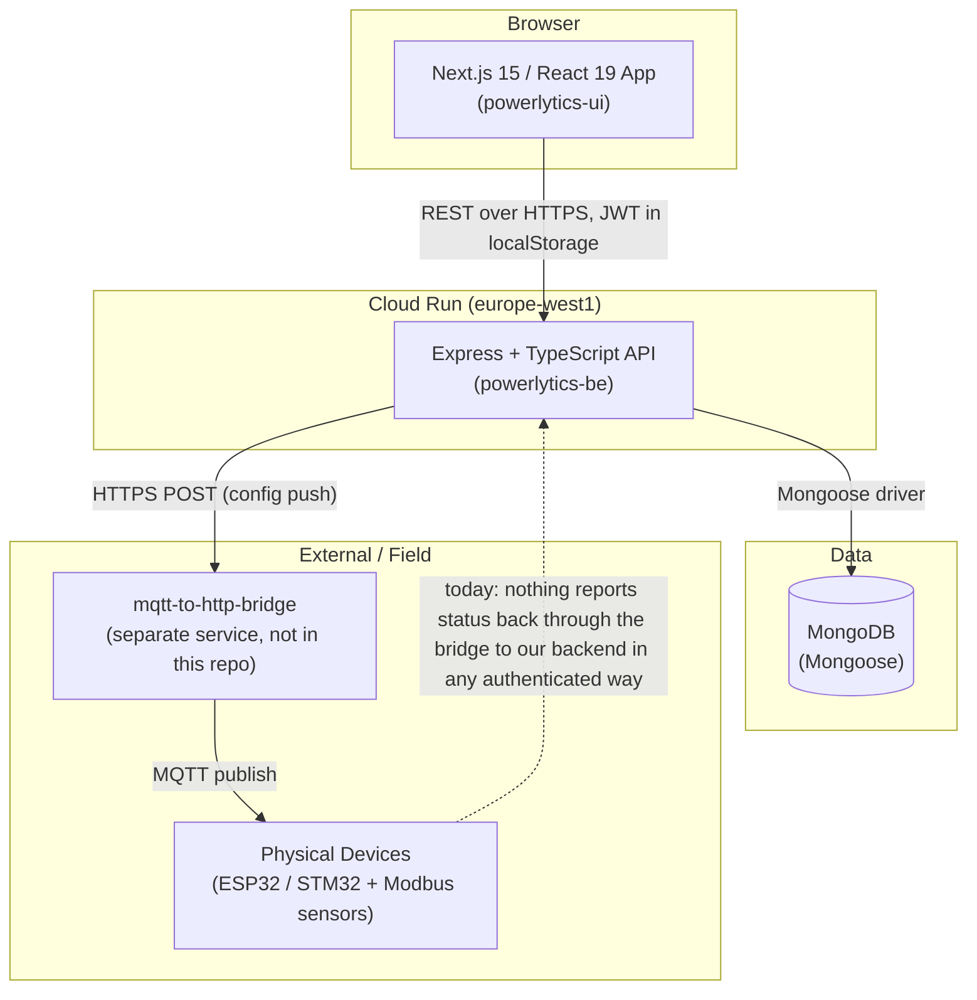
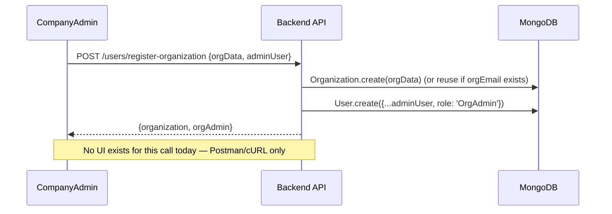
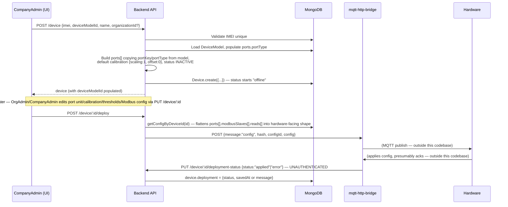
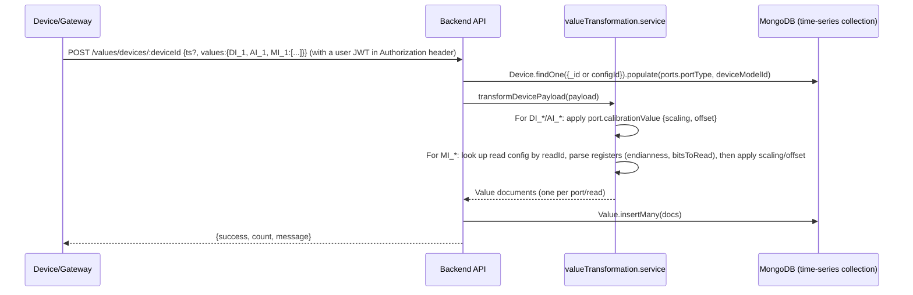
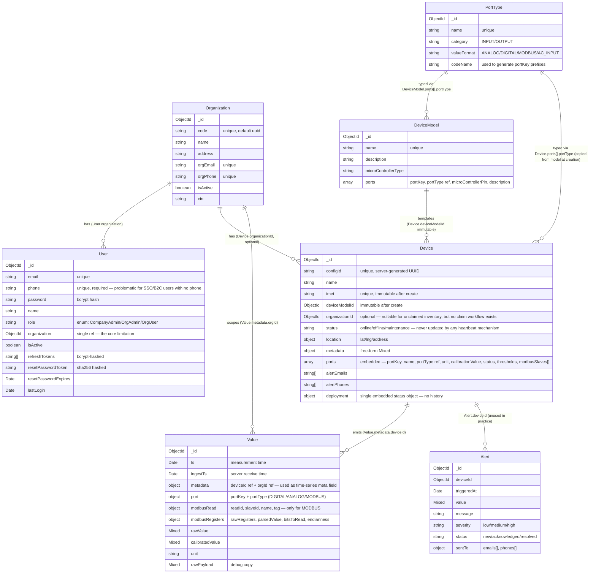
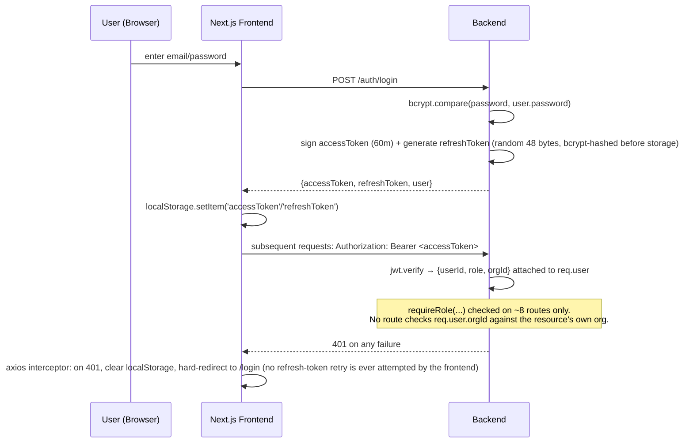

# 02 — Existing System Analysis (Ground Truth)

This document describes what is actually implemented in the repository today, verified by reading every backend module, every model, every route, and the frontend's data-fetching and RBAC layers. Where the repository's own `docs/prompt/*.md` files describe something different (several of them describe an *aspirational* rebuild, not the current system), this document calls that out explicitly rather than repeating it.

---

## 1. Overall Architecture (Current)



**Deployment today:** frontend on Vercel (`powerlytic-ui.vercel.app` and branch previews), backend on Google Cloud Run (`powerlytic-be-github-...run.app`), database on MongoDB (driver string defaults to `mongodb://localhost:27017/iot-monitor`, production value is presumably MongoDB Atlas but the connection string is only ever read from `MONGO_URI`). There is no infrastructure-as-code, no `docker-compose.yml`, and no staging environment definition in the repo.

CORS is an explicit allow-list of five hardcoded origins in `app.ts`, which means adding a new frontend deployment (e.g., a new Vercel preview URL) requires a backend code change and redeploy.

## 2. Repository / Folder Structure (Current)

```
powerlytics-main/
├── docs/
│   └── prompt/                       # Aspirational rebuild docs — NOT a description of current code
├── powerlytics-be/
│   ├── src/
│   │   ├── app.ts                    # Express app, CORS allow-list, route mounting
│   │   ├── server.ts                 # HTTP listener bootstrap
│   │   ├── config/
│   │   │   ├── db.ts                 # Mongoose connection
│   │   │   └── env.ts                # process.env wrapper (declares MQTT_URL/REDIS_URL — both unused dead config)
│   │   ├── middlewares/
│   │   │   └── auth.middleware.ts    # authMiddleware, requireRole, requireSameOrg (requireSameOrg is defined but never imported anywhere)
│   │   ├── modules/
│   │   │   ├── Auth/                 # login, refresh, logout, password reset, /me
│   │   │   ├── User/                 # CRUD + registration flows
│   │   │   ├── Organization/         # CRUD
│   │   │   ├── Device/               # CRUD + config + deployment (the largest module)
│   │   │   ├── DeviceModel/          # CRUD (no auth at all on its routes)
│   │   │   ├── PortType/             # CRUD (taxonomy of port categories/value formats)
│   │   │   ├── Value/                # telemetry ingestion + 11 read views
│   │   │   ├── Alert/                # CRUD scaffolding only, not wired to anything
│   │   │   └── healthChecks/
│   │   ├── utils/
│   │   │   ├── constants/            # user.ts, port.ts, modbus.ts
│   │   │   └── transformers/         # config-hash.ts, modbusTransformer.ts
│   │   └── samples/                  # Example payloads (config_to_machine.ts, device.ts, value_from_machine_to_BE.ts) — documentation-as-code, not executed
│   ├── dist/                         # Stale compiled output — contains a Port/ and DeviceGroup/ module that no longer exist in src/. This should never have been committed.
│   ├── postman/                      # A Postman collection + two environments
│   └── docs/
│       ├── API_REFERENCE.md          # Good, accurate doc — but only for the Value module
│       └── FRONTEND_QUICK_REFERENCE.md
└── powerlytics-ui/
    └── app/
        ├── (pages)/
        │   ├── login/
        │   └── dashboard/
        │       ├── page.tsx                       # dashboard home
        │       ├── users/                         # list only, no create/edit/delete UI
        │       ├── organizations/                 # list, create, detail
        │       ├── devices/                        # list, create, detail, edit (incl. Modbus slave/read sub-forms), values (table/chart/snapshot), update-values (a telemetry *simulator* for testing)
        │       ├── device-models/                  # list, create, detail
        │       └── port-types/                     # list, create
        ├── _components/                            # Design-system-ish primitives (Button, Card, Inputs/*, GenericTable, layout/*)
        ├── _lib/
        │   ├── api/axios.ts                        # axios instance, attaches JWT from localStorage, hard-redirects to /login on 401
        │   ├── context/AuthContext.tsx             # wraps /auth/me via React Query
        │   ├── _react-query-hooks/                 # one folder per resource
        │   └── utils/rbac/                         # roles.ts, resources.ts, permissions.ts, can.ts, usePolicy.ts, policies/, RoleProtectedGuard.tsx
        └── providers.tsx                            # QueryClientProvider + AuthProvider
```

## 3. Module Responsibilities (Current Backend)

| Module | Responsibility | Auth on its routes? |
|---|---|---|
| `Auth` | Login (email+password, bcrypt), refresh-token rotation, logout (revokes one stored refresh token), password reset (returns the reset token **in the API response** — a comment in the code itself flags this as dev-only, but there is no production branch that does anything different), `/me` | `/me` and `/logout` only |
| `User` | CRUD, plus three registration flows: `registerCompanyAdmin`, `registerOrganizationAndAdmin` (creates an org + its first OrgAdmin in one call), `registerOrgUser` | Mixed — see §9 |
| `Organization` | CRUD, and `getOrganizationById` also returns that org's users and devices in one payload | **All routes require *any* authenticated user — no role or org-scope check at all** |
| `Device` | CRUD with strong immutability enforcement (IMEI, configId, deviceModelId, portKey, and portType are all protected against mutation once set), config retrieval, and the three config-deployment endpoints | CRUD requires `CompanyAdmin`; deployment-status callback (used by hardware) has **no auth at all** |
| `DeviceModel` | CRUD for hardware templates; auto-generates `portKey` values (e.g. `AI_1`, `MI_2`) from each port's `PortType.codeName` plus a per-type counter at creation time | **No auth at all on any route** |
| `PortType` | CRUD for the taxonomy of port categories (`INPUT`/`OUTPUT`) × value formats (`ANALOG`/`DIGITAL`/`MODBUS`/`AC_INPUT`) | Requires login, but **no role check** — any OrgUser can edit platform-wide taxonomy |
| `Value` | Telemetry ingestion (`storeValues`) and 11 read endpoints (latest, by-port, by-modbus-read, stats, table view, snapshot, time-series, time-series-modbus, status summary, export) | Requires login, but ingestion uses a **user JWT**, not a device credential — see §10 |
| `Alert` | Mongoose model + full CRUD controller exist; nothing in `Value`'s ingestion path ever creates an `Alert`, and the frontend has no alerts page | **No auth at all on any route** |

## 4. Business Flows (As Implemented Today)

### 4.1 Organization & User Onboarding

There is no self-service signup. The only path into the system is:

1. A `CompanyAdmin` account is seeded once at backend startup if none exists (`seed-companny-admin.route.ts`; note the filename typo — it's never imported by `app.ts`, so **this seeding code does not currently run at all** unless something else calls it).
2. A `CompanyAdmin` calls `POST /api/users/register-organization` with `{ orgData, adminUser }`. This creates the `Organization` document and one `OrgAdmin` user in a single transaction-less call (two separate `create()`s, no rollback if the second fails).
3. That `OrgAdmin` (or a `CompanyAdmin`) calls `POST /api/users/register-org-user` to add more users to the org, choosing their role from `'OrgAdmin' | 'Operator' | 'Viewer'` — **note this is a second, inconsistent role vocabulary**: the `User` schema's `role` enum only allows `'CompanyAdmin' | 'OrgAdmin' | 'OrgUser'`. Passing `Operator` or `Viewer` here will fail Mongoose's enum validation. This is a real bug, not a style nit — the registration flow that is supposed to create lower-privilege users cannot actually do so today.

There is no email verification, no invitation-link flow, and no UI for any of `register-company-admin` / `register-organization` / `register-org-user` — they exist only as Postman-collection-tested API endpoints.



### 4.2 Device Onboarding (Manufacturing → Config)



A device can be created **without** an `organizationId` (it's optional on the schema) — so the data model already has the concept of an unclaimed/inventory device, but **there is no claim workflow, no claim code, and no UI** for a customer to later attach an unowned device to their organization. The only way to associate a device with an org is `organizationId` being passed at creation time, or an admin doing a raw `PUT /device/:id` (which is technically allowed to change `organizationId` — the immutability logic only blocks `imei`, `configId`, and `deviceModelId`).

### 4.3 Telemetry Flow (Monitoring)



Calibration: `calibratedValue = rawValue * scaling + offset`, applied identically to plain analog/digital ports and to parsed Modbus reads (Modbus reads also support their own per-read `scaling`/`offset` independent of the port-level one).

Validation gap confirmed in code: any `portKey` in the incoming payload that doesn't match a port already on the device is **silently skipped** (`console.warn` only) rather than rejected or quarantined — a typo'd `portKey` from firmware fails silently with no operator-visible signal.

### 4.4 Config Deployment Flow (Detailed)

Already shown in §4.2 above; the contract worth calling out explicitly because it's central to the "don't introduce direct MQTT" requirement for v2:

- **Direction backend → bridge:** `POST {EXTERNAL_DEVICE_API_URL}` with body `{ message: "config", hash, configId, config }`, where `hash` is a SHA-256-style hash (see `utils/transformers/config-hash.ts`) of the config object, used so the device/bridge can detect whether the config actually changed.
- **Direction bridge → backend:** `PUT /device/:id/deployment-status` with `{ status: 'applied' | 'error', message? }`. This is the **single biggest authentication hole** in the backend: the route comment literally says `// No auth - called by device`, but it is reachable by anyone on the internet who knows or guesses a Mongo ObjectId, and it lets them flip any device's deployment status.
- `EXTERNAL_DEVICE_API_URL` defaults (if the env var is unset) to a **hardcoded URL containing what looks like one specific device/command ID** (`.../c2d/commands/696bf997ecbc1c803c08fc2a`) — i.e., the fallback default is not a generic bridge endpoint, it's a leftover pointer to one test device. In any environment where the env var isn't set, every device's config would be posted to that single hardcoded path.
- There is no deployment **history** — `device.deployment` is a single embedded object that gets overwritten on every deploy. You cannot see what was deployed last Tuesday.

### 4.5 Actuation — Not Implemented

The product spec docs in `docs/prompt/` describe a full actuate → ack pipeline. **It does not exist in code.** There is no `POST /device/:id/actuate` route, no command model, no queue. `PortType` does have an `OUTPUT` category and `Device.ports[]` can theoretically represent a relay, but nothing reads or writes an output value anywhere in the backend. This is a feature gap to build, not a flow to migrate.

### 4.6 Alerts — Scaffolding Only

`Alert.model.ts` and a full CRUD controller exist, with **no authentication on any of its five routes**, and **nothing else in the codebase ever calls `Alert.create()`**. There is no rule evaluation, no threshold checking during telemetry ingestion, and no notification delivery of any kind (no email/SMS/webhook integration exists anywhere in the dependency list). Treat this as 100% greenfield for v2.

## 5. Entity Relationships (Current, As Modeled in Mongoose)



**The structural limitation that drives most of the redesign:** `User.organization` is a single optional `ObjectId`. A user cannot belong to two organizations, there is no per-organization role (role is a single global field on the user), and there is no concept of a personal/B2C tenant at all — every user is implicitly either staff (`CompanyAdmin`, no org) or tied to exactly one org. B2C support cannot be bolted onto this shape without either (a) creating a synthetic one-user "organization" per consumer — a hack the business explicitly asked to avoid — or (b) the `Workspace`/`WorkspaceMembership` redesign in `05-database-design.md`.

## 6. Database Schema Inventory (MongoDB Collections)

| Collection | Approx. document count driver | Notable indexes | Notes |
|---|---|---|---|
| `users` | 1 per person | unique `email`, unique `phone` | `phone` required+unique is a real blocker for SSO-only or phone-less B2C signups |
| `organizations` | 1 per B2B customer | unique `code`, unique `orgEmail`, unique `orgphone` | |
| `devicemodels` | 1 per hardware template | unique `name`; compound unique `{name, ports.portKey}` | No published/immutable flag despite that being a stated business rule in the spec docs — currently any field can be edited post-creation via `updateDeviceModel` (route is commented out in `DeviceModel.route.ts` though, so it's currently unreachable — but the immutability is not enforced in the model/service either way) |
| `porttypes` | small, ~10s | unique `name` | Global taxonomy, no org scoping (correctly — this should stay platform-global) |
| `devices` | 1 per physical unit | unique `imei`, unique `configId` | Ports, calibration, thresholds, and full Modbus slave/read trees are **embedded**, not normalized |
| `values` | telemetry, highest volume by far | `{metadata.deviceId, ts}`, `{metadata.deviceId, port.portKey, ts}`, `{metadata.deviceId, modbusRead.readId, ts}`, `{metadata.orgId, ts}` | Correctly implemented as a native MongoDB **time-series collection** (`timeField: ts`, `metaField: metadata`) — this part of the design is good and the indexing strategy is sound for the access patterns the UI uses |
| `alerts` | 0 in practice | `{status, triggeredAt}` | Unused |

No soft-delete pattern exists anywhere (`findByIdAndDelete` is used throughout — deletes are hard deletes). No audit log of any kind exists. No schema versioning/migration tool is wired in (no Mongoose migration framework, no Prisma, nothing).

## 7. API Inventory (Current)

Base path: `/api`. Every endpoint below is exactly what's mounted in `app.ts` and the per-module route files — this is not the aspirational API from the prompt docs.

| Method & Path | Auth Required | Role Required | Notes |
|---|---|---|---|
| `GET /health-check` | none | — | |
| `POST /auth/login` | none | — | |
| `POST /auth/refresh` | none | — | Body-based, not cookie-based; **bug:** issues the new access token using `signRefreshToken()` (60m vs the intended access-token signer) — see §9 |
| `POST /auth/request-reset` | none | — | Returns the reset token in the JSON response body (commented as dev-only, but no env-gating exists) |
| `POST /auth/reset-password` | none | — | |
| `GET /auth/me` | yes | — | |
| `POST /auth/logout` | yes | — | |
| `POST /organizations` | yes | **none** | Any authenticated user can create an organization |
| `GET /organizations` | yes | **none** | Any authenticated user can list **all** organizations |
| `GET /organizations/:id` | yes | **none** | Returns org + all its users + all its devices to any authenticated user, regardless of which org they belong to |
| `PUT /organizations/:id` | yes | **none** | Any authenticated user can edit any organization |
| `DELETE /organizations/:id` | yes | **none** | Any authenticated user can delete any organization |
| `GET /users/org/:orgID` | yes | **none** | Cross-tenant user-list leak |
| `GET /users` | yes | `CompanyAdmin` or `'orgAdmin'` (lowercase) | **Bug:** the real role string is `OrgAdmin`; the lowercase literal here means OrgAdmins can never pass this check |
| `GET /users/:id` | yes | **none** | Any authenticated user can fetch any other user's full profile by ID |
| `PUT /users/:id` | yes | **none** | Any authenticated user can edit any other user, including their `role` and `organization` fields |
| `DELETE /users/:id` | yes | **none** | Any authenticated user can delete any other user |
| `POST /users/register-company-admin` | yes | `CompanyAdmin` | |
| `POST /users/register-organization` | yes | `CompanyAdmin` | |
| `POST /users/register-org-user` | yes | `OrgAdmin` or `CompanyAdmin` | Role enum bug described in §4.1 makes this fail for `Operator`/`Viewer` |
| `POST /device` | yes | `CompanyAdmin` | |
| `GET /device` | yes | **none** | No automatic org filter — only filters if the caller passes `?organizationId=` themselves |
| `GET /device/:id` | yes | **none** | |
| `GET /device/:id/config` | yes | **none** | |
| `PUT /device/:id` | yes | `CompanyAdmin` | |
| `DELETE /device/:id` | yes | `CompanyAdmin` | |
| `POST /device/:id/deploy` | yes | `OrgAdmin` or `CompanyAdmin` | No check that the caller's org owns this device |
| `GET /device/:id/deployment-status` | yes | **none** | |
| `PUT /device/:id/deployment-status` | **none at all** | — | Called by the bridge/hardware; wide open |
| `POST /device-models` | **none at all** | — | |
| `GET /device-models` | **none at all** | — | |
| `GET /device-models/:id` | **none at all** | — | |
| `DELETE /device-models/:id` | **none at all** | — | |
| `POST /port-types` | yes | **none** | |
| `GET /port-types` | yes | **none** | |
| `GET /port-types/:id` | yes | **none** | |
| `PUT /port-types/:id` | yes | **none** | |
| `DELETE /port-types/:id` | yes | **none** | |
| `POST /values/devices/:deviceId` | yes (user JWT, not device credential) | **none** | Any authenticated user, from any org, can post telemetry to any device by ID |
| `GET /values/devices/:deviceId` (+ 10 more read views under this path) | yes | **none** | All 11 read endpoints have the same cross-tenant gap — any authenticated user can read any device's telemetry |
| `POST /alerts`, `GET /alerts`, `GET /alerts/:id`, `PUT /alerts/:id`, `DELETE /alerts/:id` | **none at all** | — | |

**Summary:** of roughly 38 routes, 6 have no authentication at all, and of the remaining 32, only 8 have any role check, and **zero** have a server-side check that the resource being accessed belongs to the caller's own organization. The `requireSameOrg` helper exists in `auth.middleware.ts` for exactly this purpose and is never imported by any route file.

## 8. Authentication & Authorization Flow (Current)



Tokens are stored in `localStorage`, which is readable by any script on the page (XSS exposure) and is not sent automatically with `withCredentials` cookie semantics — `axios.create({ withCredentials: true })` is set, but nothing in the backend ever sets a cookie, so that flag has no effect today.

The frontend's RBAC layer (`app/_lib/utils/rbac/`) is a clean, three-part design — `roles.ts` / `resources.ts` define the vocabulary, `permissions.ts` is a static `Role → Resource → Action[]` map, and `policies/*.ts` allow per-resource, data-aware overrides (e.g., `organizationsPolicy.canView` checks `user.orgId === data._id` for non-`CompanyAdmin` roles). `RoleProtectedGuard` wraps pages/components and calls `canWithPolicy`. **This is a good pattern and is preserved and extended in v2** (see `07-authorization-rbac-design.md`) — its only flaw is that it is the *only* place these rules are enforced; the backend does not mirror them, so the UI hiding a button is the entire security boundary today.

## 9. Notable Bugs Found During Analysis (Not Opinions — Reproducible From Code)

1. **`AuthService.refresh()` signs the new access token with `signRefreshToken()` instead of `signAccessToken()`** (`auth.service.ts`). The "new access token" returned from `/auth/refresh` is actually a 10‑day token, not a 60‑minute one. This is a security-relevant bug: it silently extends the access-token lifetime by 240x on every refresh.
2. **Role-string case mismatch** in `User.route.ts`: `requireRole(['CompanyAdmin', 'orgAdmin'])` — the real enum value is `OrgAdmin`. OrgAdmins can never list users via `GET /users`.
3. **Role enum mismatch between registration and schema**: `registerOrgUser` accepts `role: 'OrgAdmin' | 'Operator' | 'Viewer'`, but `User`'s Mongoose schema enum is `['CompanyAdmin', 'OrgAdmin', 'OrgUser']`. Creating an `Operator` or `Viewer` via this endpoint throws a Mongoose validation error.
4. **`deploymentService.updateDeploymentStatus` route has zero authentication** — anyone can flip any device's deployment status by ID.
5. **`EXTERNAL_DEVICE_API_URL` fallback default is a hardcoded single-device URL**, not a generic bridge base path.
6. **Modbus slave update path never generates a `slaveId` for a newly-added slave** (`device.service.ts`, `updateDevice`) — the reads array generates a `readId` via `randomUUID()` if missing, but the parent `slaveId` is just `slave.slaveId` with no fallback, so a new slave added without a client-supplied ID is stored with `slaveId: undefined`.
7. **`seed-companny-admin.route.ts`** (filename typo preserved from source) is never imported by `app.ts` or `server.ts` — the seed-on-boot behavior described in its own comment does not currently execute.
8. **`dist/` is committed and stale** — it still contains compiled output for a `Port` module and a `DeviceGroup` module, neither of which exists in `src/` anymore. This is evidence of a prior refactor (device ports and groups were once their own top-level collections and were later folded into embedded arrays on `Device`/`DeviceModel`) and is a maintenance hazard if anyone ever runs the stale `dist/` in production by mistake.
9. **`createUser` controller exists in `User.controller.ts` but is never wired to any route** — dead code that bypasses all of the registration service's validation if it were ever accidentally exposed.
10. **No request body validation library anywhere** (no Zod/Joi/class-validator). Every controller trusts `req.body` shape implicitly; malformed input mostly surfaces as a 500 from a Mongoose cast error rather than a clean 400.

## 10. Current UI Architecture

- **Framework:** Next.js 15 App Router, React 19, all interactive pages are `"use client"`.
- **Styling:** Tailwind v4 + daisyUI, plus FontAwesome and lucide-react icons.
- **Data layer:** TanStack Query v5 for all server state (one hook file per resource under `_lib/_react-query-hooks/`), Zustand is a dependency but not actually used by any current page (no `create()` call exists in the page/component tree we reviewed) — likely scaffolded for future use.
- **Forms:** React Hook Form with `useFieldArray` for the genuinely complex nested forms (Modbus slave/read configuration on the device edit page is the most complex form in the app — multiple levels of field arrays).
- **Auth wiring:** `AuthContext` (wraps `/auth/me`), `Authenticator` (redirects based on session presence at the page level), `RoleProtectedGuard` (per-page/component permission gate).
- **Tables:** a single `GenericTable` wrapper around TanStack Table, reused for users/devices/organizations/port-types lists.
- **Pages that exist:** dashboard home, login, users (list only), organizations (list/create/detail), devices (list/create/detail/edit/values/update-values-simulator), device-models (list/create/detail), port-types (list/create).
- **Pages that do not exist despite backend support:** user create/edit/delete, device claim, device-model publish/version, alerts (any), audit log (none exists anywhere), actuation (no backend support either).
- **Navigation:** a single flat sidebar (`nav.ts`) gated per-item by `RoleProtectedGuard` on `Resources.*` — there is no concept of a separate admin surface; every role uses the same nav with items hidden/shown.

## 11. Constraints & Technical Debt Summary

- No automated tests anywhere in either package (no `*.test.*`/`*.spec.*` files found).
- No CI configuration (no `.github/workflows`).
- No OpenAPI/Swagger spec — the only API documentation is the hand-written `API_REFERENCE.md` (Value module only) and a Postman collection.
- No request validation layer.
- No structured logging (only `console.log`/`console.error`).
- No background job/queue infrastructure — `MQTT_URL` and `REDIS_URL` are declared in `env.ts` and never read anywhere else.
- No rate limiting on any route, including the public, unauthenticated `/auth/login`.
- No audit trail for any sensitive action (device reassignment, role changes, deletions).
- Hard deletes everywhere; no recovery path for accidental deletion.
- A single global CORS allow-list hardcoded in source.

## 12. Missing Features (Relative to the Business' Own Stated Goals)

- Actuation (relay/output control) — data model hints exist (`OUTPUT` port category) but no command flow.
- Alert rule evaluation and notification delivery — model exists, nothing else does.
- Device claim/transfer workflow for inventory devices.
- DeviceModel publish/immutability/versioning.
- Any B2C/personal-tenant concept.
- Multi-organization membership for a single user.
- Audit logging.
- Self-service signup, invitations, email verification.
- SSO/OIDC.

## 13. Scalability Issues

- Embedded Modbus configuration (slaves → reads, multiple levels deep) inside `Device` documents means any single port-config edit rewrites the entire device document; this is fine at current scale but degrades as device port counts and Modbus slave counts grow.
- `Value` ingestion does one `insertMany` per device payload with no batching/backpressure control and no queue — a burst of devices reporting simultaneously hits MongoDB directly and synchronously inside the request/response cycle.
- No caching layer anywhere (every `/me`, every device list, every org lookup is a fresh DB round-trip).
- A single Cloud Run service handles user-facing CRUD traffic and telemetry ingestion together — a telemetry spike can starve interactive dashboard requests, and vice versa.

## 14. Security Issues (Consolidated From Above)

This is the single most important section to carry forward into the redesign, because it is the primary reason a rebuild is justified over an incremental patch:

1. Cross-tenant data exposure on Organizations, Users, Devices, Telemetry (Value), and DeviceModels — confirmed by reading the route files, not inferred.
2. An unauthenticated endpoint that lets anyone mutate device deployment state.
3. An unauthenticated, fully-open CRUD surface for DeviceModels and Alerts.
4. JWT access tokens in `localStorage` (XSS-exposed).
5. A refresh-token bug that issues long-lived tokens where short-lived ones were intended.
6. Password reset tokens returned directly in API responses rather than only ever being emailed.
7. No rate limiting on authentication endpoints (brute-force exposure).
8. No backend input validation (injection/type-confusion surface, though Mongoose's schema casting absorbs some of this).

## 15. Areas That Must Be Redesigned (Not Merely Refactored)

| Area | Why a redesign, not a patch |
|---|---|
| Tenancy model (`User.organization`) | Single-org-per-user cannot represent B2C, multi-org users, or platform staff cleanly. Everything downstream (auth claims, RBAC checks, query filters) assumes this shape. |
| Authorization enforcement | Currently ad hoc per-controller (and mostly absent). Needs to become a single, shared, declarative layer (guards/policies) that cannot be forgotten on a new route. |
| Database engine | MongoDB's embedded-document model fits the device/port/Modbus tree well, but fits the *tenant, membership, and audit* side of the domain poorly — those are inherently relational (who can see what, joined across users/workspaces/roles). Moving to Postgres lets us model tenancy and audit correctly while keeping a JSON/JSONB column for the genuinely document-shaped device configuration tree. |
| Device identity & device-to-cloud auth | Devices currently authenticate to the telemetry API using a *user's* JWT. Devices need their own credential type, independent of any human session. |
| Config deployment auth | The bridge↔backend contract needs real authentication in both directions; right now it's a bearer-token call out (fine) and a wide-open callback in (not fine). |
| Actuation & Alerting | Both need to be designed and built essentially from zero — there's no existing implementation to preserve beyond the schema sketches. |
