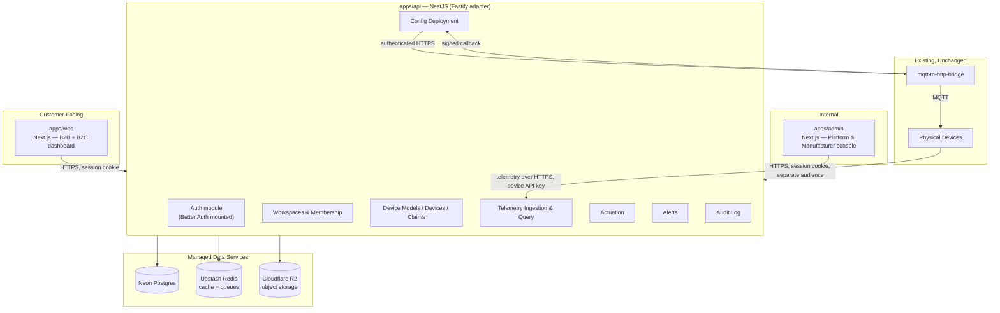

# 04 — Future Architecture Overview

## 1. Guiding Principles

1. **Workspace is the only tenant concept.** No code path treats "organization" and "personal account" as different shapes of data — they're the same `Workspace` row with a different `type`.
2. **Authorization is enforced once, centrally, server-side.** The frontend's existing role/resource/action/policy pattern is good UX scaffolding (hide buttons the user can't use), but it is never the security boundary. The backend re-checks everything.
3. **The device boundary is a hard line.** Devices never get a human session token. Humans never get a device credential. The HTTPS bridge to MQTT is the only thing that talks to hardware, and that does not change.
4. **Start as a modular monolith; keep the seams that let pieces be extracted later.** Telemetry ingestion is the most likely thing to need to scale independently of the rest of the API — it is built as its own NestJS module with its own queue, so it can become its own deployable service later without a redesign.
5. **No component that requires Docker to run locally.** Every dependency (Postgres, Redis) is a managed cloud free tier reachable from a laptop with nothing installed beyond Node and pnpm.

## 2. High-Level System Diagram

## 3. Key Architectural Decisions

| # | Decision | Chosen | Rejected / Alternatives Considered | Why |
|---|---|---|---|---|
| AD-1 | Tenant model | `Workspace` (type `ORGANIZATION` \| `PERSONAL`) + `WorkspaceMembership` (many-to-many, one role each) | Two separate data models for B2B vs. B2C; a synthetic 1-user org per consumer | A single shape with a type discriminator means every permission check, every query filter, and every UI screen works for both segments without branching logic. |
| AD-2 | Primary database | PostgreSQL on Neon | MongoDB (status quo), DynamoDB | The hard part of this domain — who can see what, across users/workspaces/roles/devices — is fundamentally relational. Postgres's `JSONB` columns absorb the genuinely document-shaped parts (Modbus slave/read trees, device metadata) without forcing the relational parts into an unnatural embedded shape. Neon adds branch-per-PR/branch-per-test databases, which directly solves the "no Docker locally" requirement for integration testing. |
| AD-3 | Cache / queue | Upstash Redis (HTTP-based, serverless) | Self-hosted Redis (needs Docker locally or a separate always-on host), no cache at all | Upstash's REST/HTTP client needs no persistent TCP connection and no local installation, and the free tier is generous enough for an early-stage product. Used for: session/permission cache, rate limiting, and a lightweight job queue (BullMQ-compatible) for async work (alert evaluation, deployment dispatch retries, notification sending). |
| AD-4 | Backend framework | **NestJS**, running on the **Fastify** HTTP adapter | Plain Express (status quo), plain Fastify, Next.js API routes only, "hybrid" with no backend framework | See §4 below — this gets its own breakdown because it's one of the most consequential calls in this document. |
| AD-5 | Authentication provider | **Better Auth** | Auth.js/NextAuth, Clerk, Lucia, Keycloak (excluded per requirement) | See `06-authentication-design.md` for the full comparison. Short version: self-hosted, Postgres-native, has a first-class multi-tenant `organization` plugin that maps directly onto `Workspace`, no per-MAU cost, and (as of 2026) is the team now also stewarding Auth.js — i.e., it's the forward path the wider ecosystem is consolidating around, not a niche bet. |
| AD-6 | One app vs. many apps | **Hybrid**: one customer-facing app (serves both B2B and B2C) + one separate internal admin app | Single app with role-based UI for everyone; fully separate apps per role | See §5 below. |
| AD-7 | Telemetry storage | Partitioned PostgreSQL table (range-partitioned by month) on the same Neon instance, with a documented threshold for moving to a dedicated time-series store | TimescaleDB (not available as a Neon extension), ClickHouse, MongoDB time-series (status quo) | Keeps the stack to one database for V1, which matters for the "no Docker, free tier" constraint, while leaving a clear, pre-planned exit ramp (`15-scaling-strategy.md`) before it becomes a problem. |
| AD-8 | Device communication | Unchanged: backend never speaks MQTT; it calls the existing HTTPS bridge | Direct MQTT client in backend, EMQX broker | Explicit constraint from the business — the abstraction already works and isolates the backend from broker operations entirely. |
| AD-9 | Monorepo tooling | Turborepo + pnpm workspaces | Separate repos for frontend/backend, Nx | Turborepo gives shared TypeScript types between `apps/api` and `apps/web`/`apps/admin` (via a `packages/types` and `packages/permissions` package) without needing a published npm package, while each app still deploys independently. |

## 4. Backend Framework Decision, In Detail

The product has three distinct kinds of HTTP traffic with different needs:

- **Interactive, human-facing CRUD** (workspaces, devices, users, audit log): needs structure, validation, and clear authorization checks more than it needs raw throughput.
- **Device-facing telemetry ingestion**: needs to be fast and to degrade gracefully under burst load; the logic per request (calibration, Modbus parsing) is CPU-light but the request *volume* can be high.
- **Server-to-server callbacks** from the bridge service: low volume, but security-sensitive (this is the endpoint that had zero auth before).

| Option | Fit |
|---|---|
| Express (status quo) | No enforced structure — the "every route is a free-for-all" problem in the current codebase is partly a consequence of this. Would need a from-scratch convention layer to fix the maintainability and onboarding goals. |
| Fastify (plain) | Faster than Express, has good schema-validation plugins, but is similarly unopinionated about module boundaries — you'd still be inventing your own conventions for where guards/services/DTOs live. |
| NestJS (Express adapter) | Decorator-based modules map cleanly onto the domain (`AuthModule`, `WorkspacesModule`, `DevicesModule`, ...), built-in `Guard`/`Interceptor`/`Pipe` primitives are exactly the right shape for "authorization enforced once, centrally" (AD-2 from this doc's principles), and `@nestjs/swagger` generates the OpenAPI spec from the same decorators used for validation — one source of truth instead of hand-written docs. Express adapter has more request overhead than Fastify. |
| NestJS (Fastify adapter) | All of the above, with Fastify's lower per-request overhead. This is a fully supported, common combination (`@nestjs/platform-fastify`). |
| Next.js API routes only | Couples backend deployment to the frontend framework/host, and conflates "talks to browsers" with "talks to hardware" in one runtime. Device-facing endpoints having to live inside the same Vercel functions as the dashboard is an awkward fit, and serverless cold starts are a worse match for a telemetry-ingestion endpoint than a long-running container. |
| Hybrid (no single backend framework — mix of serverless functions) | Maximizes flexibility, minimizes consistency. For a small team that needs new developers to onboard quickly, this is the wrong trade. |

**Decision: NestJS on the Fastify adapter**, structured as one module per bounded context (see `10-backend-architecture.md`). If telemetry ingestion ever needs to be physically separated from the rest of the API (per the scaling strategy), the `TelemetryModule`'s service layer has no dependency on any other module's service layer beyond shared, stateless utilities (calibration, Modbus parsing) — it can be lifted into its own NestJS app with minimal change, because Nest modules are already designed to be extractable this way.

## 5. Single App vs. Multiple Apps vs. Hybrid — Detailed Reasoning

The user population spans: Platform Admins, Manufacturer staff, Workspace (Org) Admins, Operators/Engineers, Viewers, and individual B2C customers.

**Option A — One app, fully role-based.** Every role logs into the same Next.js app; navigation and components conditionally render based on permissions (this is exactly today's pattern, just extended to more roles). 
- *Pros:* one codebase, one deploy, no duplicated layout/shell code.
- *Cons:* the bundle ships every role's code to every user (mitigated only partially by route-level code splitting); a `SuperAdmin`'s cross-workspace views (every workspace, every device, platform billing) live in the same app and the same authentication realm as a homeowner's personal dashboard, which is a larger blast radius if the customer-facing app is ever compromised (e.g., a dependency vulnerability or an XSS in a customer-data render path now sits next to platform-admin capability); release cadence is coupled — a hotfix to the admin console requires shipping (and risk-testing) the customer app too.

**Option B — Fully separate app per role.** A Platform Admin app, a Manufacturer app, a Workspace app, etc.
- *Pros:* maximum isolation and independent release cadence per surface.
- *Cons:* Workspace Admin, Operator, and Viewer are not different *products* — they're different permission levels inside the same workflows (manage devices, view telemetry, deploy config). Splitting them into separate apps means duplicating the entire devices/telemetry/config UI three to five times, which actively works against the "easy onboarding for new developers" and "maintainability" goals — there would be no single place that says "this is how the devices page works."

**Option C — Hybrid (chosen).** Two apps:
- **`apps/web`** — the customer-facing dashboard. Serves both B2B Workspace members (Admin/Operator/Viewer roles, scoped to their workspace) and B2C personal-workspace users. They share this app because they are, functionally, the same product experience at different scale/role — exactly the case Option A handles well and Option B handles badly.
- **`apps/admin`** — a separate, separately-deployed app for `SuperAdmin` and `Manufacturer` staff only. This is the case Option B handles well: these roles see cross-workspace data, manage Device Models/Port Types, and have platform-operational capabilities (impersonation for support, global audit log, billing oversight) that should never share a bundle, a session cookie audience, or a deployment pipeline with the customer-facing app.

**Why this split, concretely:**
- **Security isolation**: a vulnerability in the customer app's attack surface (the one exposed to the largest, least-trusted user population) cannot directly reach admin capability, because the admin app is a separate deployment with its own domain/subdomain and its own session audience (Better Auth supports scoping sessions to an audience/app).
- **Deployment independence**: the admin console can ship on its own schedule (it changes far less often) without coupling to customer-facing release risk, and vice versa.
- **UX clarity**: a `SuperAdmin` managing 200 workspaces needs a fundamentally different information density and navigation model (cross-workspace tables, impersonation, global search) than a homeowner checking their solar inverter's output. Cramming both into one role-conditional shell produces the kind of compromise UI that satisfies neither.
- **Code reuse where it matters, duplication where it doesn't**: both apps import the same `packages/ui` component library and the same `packages/permissions` policy package, so "what can this role do" logic is never duplicated — only the navigation shell and page composition differ.

This mirrors a pattern used by most mature SaaS products (a customer-facing app plus a separate, more tightly access-controlled internal console) and is the recommended approach.

## 6. What This Means for the Rest of the Documents

- `05-database-design.md` defines `Workspace`/`WorkspaceMembership` and every other table.
- `06` and `07` define exactly how AD-5 (Better Auth) and the role/permission model plug into NestJS guards and into both frontend apps.
- `09` and `10` flesh out AD-4 and AD-6 into folder-level detail.
- `11` and `12` keep AD-8 (the bridge boundary) and the telemetry pipeline fully specified.
- `15` explains when and how AD-7's partitioned-Postgres choice gets revisited.
