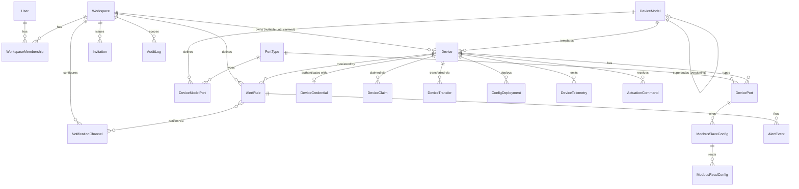

# 05 — Database Design

**Engine:** PostgreSQL 16 on Neon. **ORM:** Prisma (chosen for migration tooling, type generation shared into NestJS DTOs, and first-class Neon support; Better Auth ships a Prisma adapter, so the auth tables and the domain tables live in one schema/one migration history).

This document gives the full schema. It is organized by bounded context, matching the modules in `10-backend-architecture.md`. Tables prefixed conceptually as "Better Auth tables" are generated/managed by Better Auth's CLI (`npx @better-auth/cli generate`) and are shown here for completeness; everything else is hand-authored domain schema.

## 1. Conventions Used Throughout

- **Primary keys:** `cuid()` (collision-resistant, sortable-ish, URL-safe) for all domain tables.
- **Soft delete:** every domain table that can be deleted by a user action has a nullable `deletedAt DateTime?`. All Prisma queries in the service layer go through a shared `findManyActive`/`findFirstActive` helper that filters `deletedAt: null` by default. Hard deletes are reserved for GDPR-style erasure requests only, handled by a dedicated, audited admin operation.
- **Audit-relevant timestamps:** `createdAt DateTime @default(now())`, `updatedAt DateTime @updatedAt` on every table.
- **Tenant scoping:** every table that holds workspace-owned data has a non-nullable `workspaceId` with a foreign key and an index. There is no table where tenant scoping is "implied" by walking a join — it is always a direct column, so every query and every authorization check can filter on it in one step.
- **Money/units:** not yet needed (no billing table in this design); left for a later iteration.

## 2. Identity, Workspace & Membership (Replaces `User.organization`)

```prisma
// ---- Better Auth core tables (managed by Better Auth CLI) ----
model User {
  id              String    @id @default(cuid())
  email           String    @unique
  emailVerified   Boolean   @default(false)
  name            String?
  image           String?
  // Platform-level role. NOT a workspace role — see WorkspaceMembership for that.
  // Most users have platformRole = null (a normal customer). Only platform staff get a value here.
  platformRole    PlatformRole?
  createdAt       DateTime  @default(now())
  updatedAt       DateTime  @updatedAt

  sessions        Session[]
  accounts        Account[]
  memberships     WorkspaceMembership[]
  invitationsSent Invitation[]            @relation("InvitedBy")
  auditLogEntries AuditLog[]              @relation("ActorUser")

  @@map("user")
}

enum PlatformRole {
  SUPER_ADMIN
  MANUFACTURER
}

model Session {
  id        String   @id @default(cuid())
  userId    String
  user      User     @relation(fields: [userId], references: [id], onDelete: Cascade)
  token     String   @unique
  expiresAt DateTime
  ipAddress String?
  userAgent String?
  // Better Auth's "organization" plugin stores the active workspace on the session:
  activeOrganizationId String?
  createdAt DateTime @default(now())
  updatedAt DateTime @updatedAt

  @@index([userId])
  @@map("session")
}

model Account { // OAuth / credential provider linkage (Better Auth)
  id                String   @id @default(cuid())
  userId            String
  user              User     @relation(fields: [userId], references: [id], onDelete: Cascade)
  providerId        String   // "credential" | "google" | ...
  accountId         String
  passwordHash      String?
  accessToken       String?
  refreshToken      String?
  accessTokenExpiresAt  DateTime?
  refreshTokenExpiresAt DateTime?
  createdAt         DateTime @default(now())
  updatedAt         DateTime @updatedAt

  @@unique([providerId, accountId])
  @@index([userId])
  @@map("account")
}

model Verification { // email verification / password reset tokens (Better Auth)
  id         String   @id @default(cuid())
  identifier String
  value      String
  expiresAt  DateTime
  createdAt  DateTime @default(now())

  @@index([identifier])
  @@map("verification")
}

// ---- Domain tables (hand-authored) ----

model Workspace {
  id            String        @id @default(cuid())
  type          WorkspaceType
  name          String
  slug          String        @unique
  // Org-only fields — null for PERSONAL workspaces:
  legalName     String?
  billingEmail  String?
  cin           String?       // company identification number, carried over from current Organization.cin
  address       String?
  isActive      Boolean       @default(true)
  createdAt     DateTime      @default(now())
  updatedAt     DateTime      @updatedAt
  deletedAt     DateTime?

  memberships       WorkspaceMembership[]
  devices           Device[]
  invitations       Invitation[]
  deviceClaims      DeviceClaim[]
  deviceTransfersIn  DeviceTransfer[] @relation("ToWorkspace")
  deviceTransfersOut DeviceTransfer[] @relation("FromWorkspace")
  alertRules        AlertRule[]
  auditLogEntries   AuditLog[]
  notificationChannels NotificationChannel[]

  @@index([type])
  @@map("workspace")
}

enum WorkspaceType {
  ORGANIZATION
  PERSONAL
}

model WorkspaceMembership {
  id          String        @id @default(cuid())
  workspaceId String
  workspace   Workspace     @relation(fields: [workspaceId], references: [id], onDelete: Cascade)
  userId      String
  user        User          @relation(fields: [userId], references: [id], onDelete: Cascade)
  role        WorkspaceRole
  invitedById String?
  createdAt   DateTime      @default(now())
  updatedAt   DateTime      @updatedAt

  @@unique([workspaceId, userId])
  @@index([userId])
  @@index([workspaceId, role])
  @@map("workspace_membership")
}

enum WorkspaceRole {
  OWNER     // creator of the workspace; exactly one per ORGANIZATION workspace, auto-assigned for PERSONAL
  ADMIN     // full management of members/devices/billing within the workspace
  OPERATOR  // can manage devices, deploy config, actuate, manage alert rules — cannot manage members or billing
  VIEWER    // read-only across the workspace's devices/telemetry/alerts
}

model Invitation {
  id          String           @id @default(cuid())
  workspaceId String
  workspace   Workspace        @relation(fields: [workspaceId], references: [id], onDelete: Cascade)
  email       String
  role        WorkspaceRole
  invitedById String
  invitedBy   User             @relation("InvitedBy", fields: [invitedById], references: [id])
  status      InvitationStatus @default(PENDING)
  expiresAt   DateTime
  createdAt   DateTime         @default(now())

  @@index([workspaceId, status])
  @@index([email])
  @@map("invitation")
}

enum InvitationStatus {
  PENDING
  ACCEPTED
  EXPIRED
  REVOKED
}
```

**Why this fixes the core problem from §5 of the existing-system analysis:** a `User` no longer carries a role or an org reference at all. Every permission decision starts from "which `WorkspaceMembership` rows does this user have, and what's the role on each" — a user with two memberships is just two rows, not a schema change. Platform staff (`SUPER_ADMIN`, `MANUFACTURER`) are marked on `User.platformRole` and typically have zero workspace memberships, since their access is platform-wide and orthogonal to any one workspace.

## 3. Device Catalog & Fleet

```prisma
model PortType {
  id          String      @id @default(cuid())
  name        String      @unique
  category    PortCategory
  valueFormat ValueFormat
  codeName    String      @unique // e.g. "AI", "DI", "MI", "DO" — used to generate portKey prefixes
  description String?
  createdAt   DateTime    @default(now())
  updatedAt   DateTime    @updatedAt

  deviceModelPorts DeviceModelPort[]

  @@map("port_type")
}

enum PortCategory {
  INPUT
  OUTPUT
}

enum ValueFormat {
  ANALOG
  DIGITAL
  MODBUS
  AC_INPUT
}

model DeviceModel {
  id                 String            @id @default(cuid())
  name               String
  description        String?
  microControllerType String
  status             DeviceModelStatus @default(DRAFT)
  version            Int               @default(1)
  // Versioning: a published model is never edited. A "new version" is a new row
  // that points back at the model it supersedes, sharing a family id.
  familyId           String            @default(cuid())
  supersedesId       String?           @unique
  supersedes         DeviceModel?      @relation("ModelVersionChain", fields: [supersedesId], references: [id])
  supersededBy       DeviceModel?      @relation("ModelVersionChain")
  publishedAt        DateTime?
  publishedById      String?
  createdAt          DateTime          @default(now())
  updatedAt          DateTime          @updatedAt
  deletedAt          DateTime?

  ports   DeviceModelPort[]
  devices Device[]

  @@index([familyId])
  @@map("device_model")
}

enum DeviceModelStatus {
  DRAFT       // editable
  PUBLISHED   // immutable — application layer + a DB trigger both reject UPDATEs to ports while status = PUBLISHED
  DEPRECATED  // published, but no longer offered for new manufacturing
}

model DeviceModelPort {
  id                 String      @id @default(cuid())
  deviceModelId      String
  deviceModel        DeviceModel @relation(fields: [deviceModelId], references: [id], onDelete: Cascade)
  portKey            String      // server-generated at draft time, e.g. "AI_1" — immutable once the model is published
  portTypeId         String
  portType           PortType    @relation(fields: [portTypeId], references: [id])
  microControllerPin String?
  description        String?
  sortOrder          Int         @default(0)

  @@unique([deviceModelId, portKey])
  @@map("device_model_port")
}

model Device {
  id              String        @id @default(cuid())
  imei            String        @unique
  serialNumber    String?       @unique
  configId        String        @unique @default(cuid())
  name            String
  deviceModelId   String
  deviceModel     DeviceModel   @relation(fields: [deviceModelId], references: [id])
  workspaceId     String?       // null = unclaimed inventory
  workspace       Workspace?    @relation(fields: [workspaceId], references: [id])
  lifecycleStatus DeviceLifecycleStatus @default(MANUFACTURED)
  connectivityStatus ConnectivityStatus @default(OFFLINE)
  lastSeenAt      DateTime?
  manufacturedAt  DateTime      @default(now())
  claimedAt       DateTime?
  location        Json?         // {lat, lng, address}
  metadata        Json?         // free-form, e.g. firmwareVersion, hardwareRevision
  pointOfContact  String?
  alertEmails     String[]
  alertPhones     String[]
  createdAt       DateTime      @default(now())
  updatedAt       DateTime      @updatedAt
  deletedAt       DateTime?

  ports             DevicePort[]
  deviceCredential  DeviceCredential?
  claims            DeviceClaim[]
  transfersIn       DeviceTransfer[] @relation("ToDevice")
  transfersOut      DeviceTransfer[] @relation("FromDevice")
  configDeployments ConfigDeployment[]
  actuationCommands ActuationCommand[]
  alertRules        AlertRule[]

  @@index([workspaceId])
  @@index([deviceModelId])
  @@map("device")
}

enum DeviceLifecycleStatus {
  MANUFACTURED   // exists, no workspace
  CLAIMED        // workspace assigned, not yet configured/deployed
  ACTIVE         // claimed and has at least one successful deployment
  DECOMMISSIONED
}

enum ConnectivityStatus {
  ONLINE
  OFFLINE
  MAINTENANCE
}

// One row per port instance on a real device — mirrors DeviceModelPort 1:1 at creation time,
// then carries the owner-tunable runtime settings.
model DevicePort {
  id               String     @id @default(cuid())
  deviceId         String
  device           Device     @relation(fields: [deviceId], references: [id], onDelete: Cascade)
  portKey          String     // copied from DeviceModelPort.portKey — immutable
  portTypeId       String
  portType         PortType   @relation(fields: [portTypeId], references: [id])
  displayName      String
  unit             String?
  scaling          Decimal    @default(1) @db.Decimal(18, 6)
  offset           Decimal    @default(0) @db.Decimal(18, 6)
  thresholdMin     Decimal?   @db.Decimal(18, 6)
  thresholdMax     Decimal?   @db.Decimal(18, 6)
  thresholdMessage String?
  status           PortStatus @default(INACTIVE)
  createdAt        DateTime   @default(now())
  updatedAt        DateTime   @updatedAt

  modbusSlaves ModbusSlaveConfig[]

  @@unique([deviceId, portKey])
  @@map("device_port")
}

enum PortStatus {
  ACTIVE
  INACTIVE
}

model ModbusSlaveConfig {
  id              String        @id @default(cuid())
  devicePortId    String
  devicePort      DevicePort    @relation(fields: [devicePortId], references: [id], onDelete: Cascade)
  slaveId         String        @default(cuid())
  name            String
  baudRate        Int
  dataBits        Int
  stopBits        Int
  parity          ModbusParity
  pollIntervalMs  Int
  pollTimeoutMs   Int
  pollRetries     Int
  createdAt       DateTime      @default(now())
  updatedAt       DateTime      @updatedAt

  reads ModbusReadConfig[]

  @@unique([devicePortId, slaveId])
  @@map("modbus_slave_config")
}

enum ModbusParity {
  NONE
  EVEN
  ODD
}

model ModbusReadConfig {
  id           String              @id @default(cuid())
  slaveConfigId String
  slaveConfig  ModbusSlaveConfig   @relation(fields: [slaveConfigId], references: [id], onDelete: Cascade)
  readId       String              @default(cuid())
  name         String
  description  String?
  functionCode ModbusFunctionCode
  registerType ModbusRegisterType  // derived from functionCode, stored for query convenience
  startAddress Int
  bitsToRead   Int
  dataType     String?
  endianness   ModbusEndianness    @default(NONE)
  scaling      Decimal             @default(1) @db.Decimal(18, 6)
  offset       Decimal             @default(0) @db.Decimal(18, 6)
  unit         String?
  tag          String?
  createdAt    DateTime            @default(now())
  updatedAt    DateTime            @updatedAt

  @@unique([slaveConfigId, readId])
  @@map("modbus_read_config")
}

enum ModbusFunctionCode {
  FC_1
  FC_2
  FC_3
  FC_4
}

enum ModbusRegisterType {
  COIL
  DISCRETE
  HOLDING
  INPUT
}

enum ModbusEndianness {
  ABCD
  CDAB
  BADC
  DCBA
  NONE
}

// Device-to-cloud credential — independent of any human session.
model DeviceCredential {
  id           String   @id @default(cuid())
  deviceId     String   @unique
  device       Device   @relation(fields: [deviceId], references: [id], onDelete: Cascade)
  keyHash      String   // sha256 of the API key; the plain key is shown to the operator exactly once
  lastUsedAt   DateTime?
  revokedAt    DateTime?
  createdAt    DateTime @default(now())

  @@map("device_credential")
}

model DeviceClaim {
  id          String   @id @default(cuid())
  deviceId    String
  device      Device   @relation(fields: [deviceId], references: [id])
  workspaceId String
  workspace   Workspace @relation(fields: [workspaceId], references: [id])
  claimCode   String   @unique
  claimedById String
  claimedAt   DateTime @default(now())

  @@map("device_claim")
}

model DeviceTransfer {
  id              String    @id @default(cuid())
  deviceId        String
  device          Device    @relation("FromDevice", fields: [deviceId], references: [id])
  fromWorkspaceId String?
  fromWorkspace   Workspace? @relation("FromWorkspace", fields: [fromWorkspaceId], references: [id])
  toWorkspaceId   String
  toWorkspace     Workspace  @relation("ToWorkspace", fields: [toWorkspaceId], references: [id])
  requestedById   String
  approvedById    String?
  status          TransferStatus @default(PENDING)
  reason          String?
  createdAt       DateTime  @default(now())
  completedAt     DateTime?

  @@map("device_transfer")
  @@index([deviceId])
}

enum TransferStatus {
  PENDING
  APPROVED
  REJECTED
  COMPLETED
}
```

## 4. Configuration Deployment (Bridge Boundary)

```prisma
model ConfigDeployment {
  id            String           @id @default(cuid())
  deviceId      String
  device        Device           @relation(fields: [deviceId], references: [id])
  configHash    String
  configSnapshot Json            // the exact payload sent to the bridge, for replay/debugging
  status        DeploymentStatus @default(PENDING)
  triggeredById String
  errorMessage  String?
  sentAt        DateTime?
  acknowledgedAt DateTime?
  createdAt     DateTime         @default(now())

  @@index([deviceId, createdAt])
  @@map("config_deployment")
}

enum DeploymentStatus {
  PENDING
  SENT
  APPLIED
  ERROR
  TIMED_OUT
}
```

This is the table that fixes "no deployment history" from the analysis — every deploy is an `insert`, never an `update` of a single embedded object. `GET /devices/:id/deployments` returns the full history; "current status" is just `ORDER BY createdAt DESC LIMIT 1`.

## 5. Telemetry

```prisma
// Created as a range-partitioned table by raw SQL migration (Prisma models the "shape";
// partitioning is applied via a `prisma/migrations/.../migration.sql` step — see below).
model DeviceTelemetry {
  id              BigInt   @id @default(autoincrement())
  deviceId        String
  workspaceId     String   // denormalized from Device.workspaceId at write time — avoids a join on every query/auth check
  ts              DateTime // measurement time, reported by device
  ingestedAt      DateTime @default(now())
  portKey         String
  portValueFormat ValueFormat
  modbusReadId    String?
  modbusSlaveId   String?
  rawValue        Decimal  @db.Decimal(18, 6)
  calibratedValue Decimal? @db.Decimal(18, 6)
  unit            String?
  quality         TelemetryQuality @default(GOOD)
  rawPayload      Json?    // debug copy, same as today

  @@index([deviceId, ts(sort: Desc)])
  @@index([deviceId, portKey, ts(sort: Desc)])
  @@index([workspaceId, ts(sort: Desc)])
  @@map("device_telemetry")
}

enum TelemetryQuality {
  GOOD
  BAD
  UNCERTAIN
}

// Anything that fails port/Modbus-config validation lands here instead of being silently dropped.
model TelemetryQuarantine {
  id          String   @id @default(cuid())
  deviceId    String
  reason      String
  rawPayload  Json
  receivedAt  DateTime @default(now())

  @@map("telemetry_quarantine")
}
```

**Partitioning migration (applied via a raw SQL migration file, since Prisma doesn't natively declare partitions):**

```sql
-- Convert device_telemetry into a range-partitioned table by month, with a rolling
-- creation job (a small scheduled NestJS task, or a pg_partman extension if Neon supports it)
-- that creates next month's partition ahead of time and drops/archives partitions older
-- than the retention window (configurable; e.g. 18 months of raw telemetry, with older
-- data rolled up into a pre-aggregated table if/when that's needed — see 15-scaling-strategy.md).

CREATE TABLE device_telemetry (
  id BIGINT GENERATED ALWAYS AS IDENTITY,
  device_id TEXT NOT NULL,
  workspace_id TEXT NOT NULL,
  ts TIMESTAMPTZ NOT NULL,
  ingested_at TIMESTAMPTZ NOT NULL DEFAULT now(),
  port_key TEXT NOT NULL,
  port_value_format TEXT NOT NULL,
  modbus_read_id TEXT,
  modbus_slave_id TEXT,
  raw_value NUMERIC(18,6) NOT NULL,
  calibrated_value NUMERIC(18,6),
  unit TEXT,
  quality TEXT NOT NULL DEFAULT 'GOOD',
  raw_payload JSONB,
  PRIMARY KEY (id, ts)
) PARTITION BY RANGE (ts);

CREATE INDEX ON device_telemetry (device_id, ts DESC);
CREATE INDEX ON device_telemetry (device_id, port_key, ts DESC);
CREATE INDEX ON device_telemetry (workspace_id, ts DESC);
```

## 6. Actuation

```prisma
model ActuationCommand {
  id            String         @id @default(cuid())
  deviceId      String
  device        Device         @relation(fields: [deviceId], references: [id])
  portKey       String
  action        String         // e.g. "SET"
  requestedValue Json          // 0/1 for a relay today; left as Json so future output types aren't a migration
  status        ActuationStatus @default(PENDING)
  idempotencyKey String        @unique
  requestedById String
  acknowledgedAt DateTime?
  failureReason String?
  createdAt     DateTime       @default(now())

  @@index([deviceId, createdAt])
  @@map("actuation_command")
}

enum ActuationStatus {
  PENDING
  SENT
  ACKED
  FAILED
  TIMED_OUT
}
```

## 7. Alerting

```prisma
model AlertRule {
  id              String     @id @default(cuid())
  workspaceId     String
  workspace       Workspace  @relation(fields: [workspaceId], references: [id], onDelete: Cascade)
  deviceId        String
  device          Device     @relation(fields: [deviceId], references: [id], onDelete: Cascade)
  portKey         String
  name            String
  condition       AlertCondition
  thresholdValue  Decimal    @db.Decimal(18, 6)
  forDurationSec  Int        @default(0) // 0 = fire immediately on first breach
  severity        AlertSeverity @default(MEDIUM)
  isEnabled       Boolean    @default(true)
  createdById     String
  createdAt       DateTime   @default(now())
  updatedAt       DateTime   @updatedAt
  deletedAt       DateTime?

  events NotificationChannel[] @relation("RuleChannels")
  alertEvents AlertEvent[]

  @@index([deviceId, portKey])
  @@map("alert_rule")
}

enum AlertCondition {
  GREATER_THAN
  LESS_THAN
  EQUAL
  NOT_EQUAL
}

enum AlertSeverity {
  LOW
  MEDIUM
  HIGH
}

model AlertEvent {
  id           String      @id @default(cuid())
  alertRuleId  String
  alertRule    AlertRule   @relation(fields: [alertRuleId], references: [id])
  triggeredAt  DateTime    @default(now())
  triggerValue Decimal     @db.Decimal(18, 6)
  status       AlertEventStatus @default(NEW)
  acknowledgedById String?
  acknowledgedAt   DateTime?
  resolvedAt   DateTime?
  message      String

  @@index([alertRuleId, triggeredAt])
  @@map("alert_event")
}

enum AlertEventStatus {
  NEW
  ACKNOWLEDGED
  RESOLVED
}

model NotificationChannel {
  id          String   @id @default(cuid())
  workspaceId String
  workspace   Workspace @relation(fields: [workspaceId], references: [id], onDelete: Cascade)
  type        NotificationChannelType
  target      String   // email address, phone number, or webhook URL
  isEnabled   Boolean  @default(true)
  createdAt   DateTime @default(now())

  rules AlertRule[] @relation("RuleChannels")

  @@map("notification_channel")
}

enum NotificationChannelType {
  EMAIL
  SMS
  WEBHOOK
}
```

## 8. Audit Log

```prisma
model AuditLog {
  id          String   @id @default(cuid())
  workspaceId String?  // null for platform-level actions
  workspace   Workspace? @relation(fields: [workspaceId], references: [id])
  actorUserId String?
  actorUser   User?    @relation("ActorUser", fields: [actorUserId], references: [id])
  actorType   ActorType @default(USER)
  action      String   // e.g. "device.transfer", "member.role_changed", "device_model.published"
  targetType  String   // e.g. "Device", "WorkspaceMembership"
  targetId    String
  beforeValue Json?
  afterValue  Json?
  ipAddress   String?
  createdAt   DateTime @default(now())

  @@index([workspaceId, createdAt])
  @@index([targetType, targetId])
  @@map("audit_log")
}

enum ActorType {
  USER
  DEVICE
  SYSTEM
  BRIDGE
}
```

Audit log rows are **never** soft-deleted or covered by the retention/cleanup jobs that apply to telemetry — they are append-only for the life of the product (or until a documented, separately-approved retention policy says otherwise).

## 9. Indexing Summary (Why Each One Exists)

| Table | Index | Serves |
|---|---|---|
| `workspace_membership` | `(userId)` | "which workspaces can this user see" on every request |
| `workspace_membership` | `(workspaceId, role)` | "who are this workspace's admins" (e.g., for notifications) |
| `device` | `(workspaceId)` | every device-list query, and the authorization check "does this device belong to the caller's workspace" |
| `device_telemetry` | `(deviceId, ts DESC)` | snapshot/history queries for a single device |
| `device_telemetry` | `(deviceId, portKey, ts DESC)` | single-port time-series chart queries |
| `device_telemetry` | `(workspaceId, ts DESC)` | workspace-wide recent-activity views, and a second, independent way to enforce tenant scoping even if `deviceId` filtering were ever bypassed by a bug |
| `config_deployment` | `(deviceId, createdAt)` | deployment history list, most-recent-first |
| `audit_log` | `(workspaceId, createdAt)`, `(targetType, targetId)` | workspace audit views and "show me everything that happened to this specific device" |

## 10. Versioning & Immutability Enforcement

Two layers, matching the "never trust only one layer" lesson from the existing-system analysis:

1. **Application layer:** the `DeviceModelsService.update()` method checks `status !== 'PUBLISHED'` before allowing any port mutation, and `DevicesService.update()` strips `imei`, `configId`, and `deviceModelId` from any incoming update payload before it ever reaches Prisma (this exact pattern already existed and worked correctly in the current `device.service.ts` — it's preserved, just ported).
2. **Database layer:** a Postgres trigger on `device_model_port` rejects any `UPDATE`/`DELETE` where the parent `device_model.status = 'PUBLISHED'`, so even a bug in application code, or a manual `psql` session, cannot violate immutability.

```sql
CREATE OR REPLACE FUNCTION reject_published_model_port_mutation() RETURNS trigger AS $$
BEGIN
  IF EXISTS (
    SELECT 1 FROM device_model
    WHERE id = COALESCE(NEW."deviceModelId", OLD."deviceModelId")
    AND status = 'PUBLISHED'
  ) THEN
    RAISE EXCEPTION 'Cannot modify ports of a published DeviceModel';
  END IF;
  RETURN COALESCE(NEW, OLD);
END;
$$ LANGUAGE plpgsql;

CREATE TRIGGER trg_reject_published_model_port_mutation
BEFORE UPDATE OR DELETE ON device_model_port
FOR EACH ROW EXECUTE FUNCTION reject_published_model_port_mutation();
```

## 11. Soft Delete & Retention Policy

| Data | Policy |
|---|---|
| `Workspace`, `Device`, `DeviceModel`, `AlertRule` | Soft delete (`deletedAt`); recoverable by `SuperAdmin` for 30 days, then a scheduled job hard-deletes. |
| `DeviceTelemetry` | Not soft-deleted individually (volume makes row-level soft delete impractical); retention is partition-based — whole monthly partitions are dropped or archived to cold storage (Cloudflare R2, as Parquet) once they age past the retention window. |
| `AuditLog` | Never deleted by any automated process. |
| `Session` | Hard-deleted on logout or expiry (no business value in retaining). |

## 12. Entity Relationship Diagram (Target Schema, Condensed)


