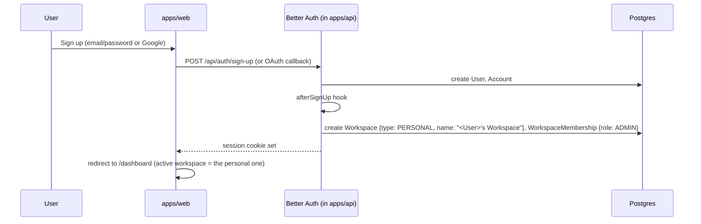
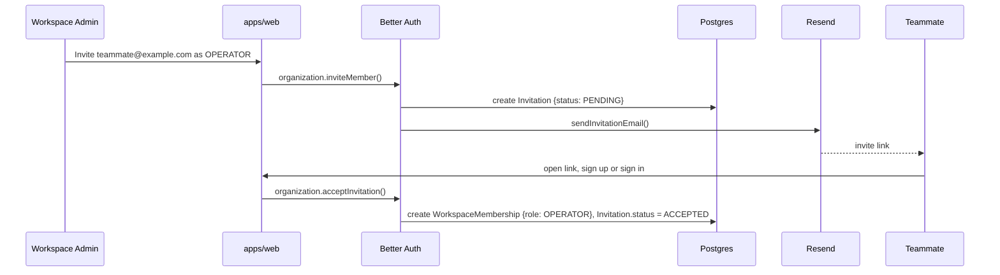
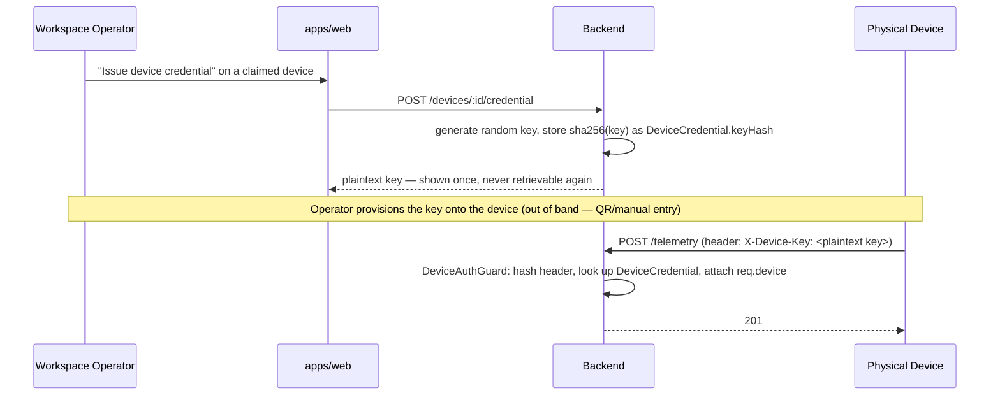

# 06 — Authentication Design

## 1. Requirement Recap

- No Keycloak.
- Compare Better Auth, Auth.js (NextAuth), Clerk, and Lucia; recommend one.
- Must support: email/password, social login (Google at minimum), workspace-scoped sessions (B2B + B2C), a separate platform-admin audience, and a device credential type that is **not** a human session at all.
- Must fit the "no Docker locally, free tier first" constraint.

## 2. Comparison

| | **Better Auth** | **Auth.js (NextAuth) v5** | **Clerk** | **Lucia** |
|---|---|---|---|---|
| Hosting model | Self-hosted, runs inside your own server | Self-hosted, runs inside your own server | Hosted SaaS | N/A |
| Status (2026) | Actively developed; as of early 2026 the Auth.js project itself is now maintained by the Better Auth team — i.e., the two are converging rather than competing | v5 has been "stable enough for production" for a long time but is still formally labeled beta after a multi-year cycle; new feature investment from its own maintainers is now directed at Better Auth | Actively developed, commercial product | **Deprecated.** The maintainer announced Lucia v3's deprecation in late 2024, effective March 2025; the project is now positioned as a learning resource for hand-rolling sessions, not a library to depend on |
| Multi-tenancy / B2B orgs | First-class `organization` plugin: organizations, members, invitations, roles, and a configurable access-control system, generated straight into your own Postgres schema | No built-in organization concept; you build it yourself on top of its adapter tables | First-class, polished `Organization` feature with hosted UI components | N/A (deprecated) |
| Database | Bring-your-own; first-class Prisma/Drizzle adapters, generates its own migration for Postgres | Bring-your-own via adapters | Clerk's own hosted user store — your Postgres database only holds a mirrored `userId` foreign key, not the actual credentials | N/A |
| Device / machine auth | Has an API-key plugin and a JWT plugin usable independently of a browser session — fits a non-human credential without bolting on something unrelated | Not designed for this; would be entirely custom code | Possible via API keys, but billed as another "user" in some configurations | N/A |
| Cost at scale | Free — no per-user fee, since it's self-hosted | Free | Free up to 50,000 monthly retained users (raised from 10,000 in a Feb 2026 pricing change); $25/mo + $0.02/MAU beyond that | N/A |
| Data residency / control | Full control — it's a row in your own database | Full control | Lives in Clerk's infrastructure; acceptable for most products, a real constraint if data residency requirements ever tighten | N/A |
| Framework coupling | Framework-agnostic core; works with Next.js, Nest/Express/Fastify (mountable as a sub-handler), Hono, etc. | Built around Next.js conventions; usable elsewhere with more friction | Best DX inside Next.js/React; framework-agnostic React SDK exists but the polish is Next.js-first | N/A |

### Recommendation: **Better Auth**

The decisive factors for this specific product:

1. **The `organization` plugin maps directly onto our `Workspace`/`WorkspaceMembership` model** — we are not building multi-tenancy on top of an auth library that doesn't know what a tenant is (Auth.js's situation) and we are not paying a per-user fee to a third party for it (Clerk's situation, which is fine for many products but unnecessary here given the self-host option is this strong).
2. **No vendor data-residency dependency.** All identity data lives in the same Neon Postgres instance as everything else — one backup story, one compliance story.
3. **It fits the device-credential requirement directly** via the API-key plugin, without inventing a second, bespoke auth system for machines.
4. **Lucia is excluded outright** — recommending a deprecated library for a 5-year product horizon would be irresponsible regardless of how clean its API is.
5. **The ecosystem signal matters for a 5-year bet.** Auth.js folding into the Better Auth team in 2026 is a strong indicator of where active development and community gravity is headed; building on Better Auth now avoids a second migration later.

Clerk remains a reasonable fallback if the team later decides they'd rather not operate authentication infrastructure at all (e.g., if the engineering team stays very small) — its free tier is generous and its organization UI components would cut frontend work. This tradeoff is worth revisiting if team size or priorities change, but it is not the recommendation today given the explicit "prefer free tiers, prefer control" framing of the requirements.

## 3. Better Auth Configuration (Conceptual)

```ts
// apps/api/src/auth/auth.config.ts
import { betterAuth } from "better-auth";
import { prismaAdapter } from "better-auth/adapters/prisma";
import { organization, admin, jwt, apiKey } from "better-auth/plugins";
import { prisma } from "../prisma";

export const auth = betterAuth({
  database: prismaAdapter(prisma, { provider: "postgresql" }),
  emailAndPassword: { enabled: true, requireEmailVerification: true },
  socialProviders: {
    google: {
      clientId: process.env.GOOGLE_CLIENT_ID!,
      clientSecret: process.env.GOOGLE_CLIENT_SECRET!,
    },
  },
  plugins: [
    organization({
      allowUserToCreateOrganization: true, // any verified user can create a B2B workspace
      creatorRole: "admin",                // maps to WorkspaceRole.ADMIN
      invitationExpiresIn: 60 * 60 * 24 * 7,
      sendInvitationEmail: sendInvitationEmailViaResend,
    }),
    admin(),     // backs the SuperAdmin platform role / impersonation-for-support capability
    jwt(),       // short-lived signed JWTs for service-to-service calls where a cookie can't travel
    apiKey(),    // backs DeviceCredential issuance/verification
  ],
  trustedOrigins: [
    process.env.WEB_APP_URL!,
    process.env.ADMIN_APP_URL!,
  ],
});
```

Mounted inside the NestJS app (Fastify adapter) at `/api/auth/*` as a raw handler, ahead of Nest's own routing, exactly as documented in Better Auth's framework-agnostic integration guides for Express/Fastify-based servers. Both `apps/web` and `apps/admin` point their Better Auth client at the same `apps/api` origin, but use `trustedOrigins`/cookie domain scoping plus an explicit audience check (see §5) to keep their sessions logically separate.

## 4. Core Flows

### 4.1 Sign-up / Sign-in (B2C, "Personal" Workspace)



### 4.2 Inviting a Member (B2B)



### 4.3 Device Authentication (Never a Human Session)



`DeviceAuthGuard` is a small, dedicated NestJS guard, entirely separate from the Better Auth session guard used on every other route. A device request never has a `User`, never has a `WorkspaceMembership`, and the `TelemetryController` only ever sees `req.device.workspaceId`, sourced from the credential — not from anything the device sends in its body. This directly fixes the existing-system gap where telemetry ingestion trusted a borrowed user JWT.

### 4.4 Platform Admin / Manufacturer Audience Separation

`apps/admin` is a separate Next.js app on a separate subdomain (e.g., `admin.powerlytic.app` vs. `app.powerlytic.app`). Better Auth's session cookie is scoped to its own domain per app (cookies are not shared across subdomains unless explicitly configured to be — we explicitly do **not** configure that). A `SuperAdmin`/`Manufacturer` user signs in independently on `apps/admin`; the session created there is checked, in addition to the normal session validity check, against `User.platformRole IS NOT NULL` by a dedicated `PlatformGuard`. A customer-app session, even for a user who happens to also hold a platform role, cannot reach admin-only controllers, because those controllers are only mounted in the `apps/admin`-facing API surface (see `10-backend-architecture.md` for how the API exposes a distinct route prefix/guard set for admin endpoints).

## 5. Session & Token Strategy

- **Browser sessions:** Better Auth's default database-backed session (a `Session` row + an HttpOnly, Secure, SameSite=Lax cookie). This directly replaces the current `localStorage`-stored JWT, removing the XSS-token-theft exposure noted in the existing-system analysis. Session lifetime: 30 days, sliding (refreshed on activity), with the ability for a workspace admin or `SuperAdmin` to forcibly revoke any session (deletes the `Session` row — the next request with that cookie fails immediately, unlike a stateless JWT which would remain valid until its own expiry).
- **Service-to-service / short-lived needs:** the `jwt()` plugin issues short-lived (5–15 min), signed JWTs on demand, for any case where a cookie can't travel (e.g., a server-side job calling back into the API). This replaces the buggy hand-rolled access/refresh token pair from the current system; the bug found in the existing analysis (refresh issuing a long-lived token by calling the wrong signer function) has no equivalent here because Better Auth's tested, audited token issuance code is used instead of hand-rolled `jsonwebtoken` calls.
- **Device credentials:** opaque API keys, hashed at rest, never expiring by default but revocable instantly (set `revokedAt`), exactly mirroring how the rest of the industry treats machine credentials (e.g., Stripe API keys).
- **Password reset:** Better Auth's built-in flow sends a real email via the configured email provider (Resend); the current system's bug of returning the reset token directly in the API response does not exist in this design — there is no code path that does that.

## 6. Rate Limiting

Better Auth ships built-in rate limiting on sensitive endpoints (sign-in, sign-up, password reset); this is enabled and backed by the Upstash Redis instance already provisioned for caching/queues, closing the "no rate limiting on auth endpoints" gap from the existing-system analysis.

## 7. What Replaces the Frontend's Current `localStorage` Token Handling

The frontend no longer manages tokens at all. `apps/web` and `apps/admin` both use Better Auth's React client (`createAuthClient`), which talks to `/api/auth/*` and relies on the HttpOnly cookie automatically — there is no token to store, attach to headers, or worry about expiring mid-session in client code. The existing axios interceptor pattern is simplified to just handling `401` → redirect-to-login; there is no more refresh-token dance to implement client-side because the session cookie's sliding-expiry renewal happens transparently server-side.
