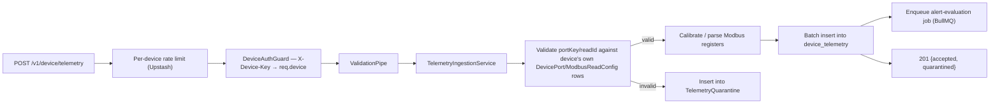

# 10 — Backend Architecture

## 1. Top-Level Shape

A single NestJS application (`apps/api`), running on the Fastify adapter, structured as one module per bounded context. It is a **modular monolith**, not a microservices system — one deployable unit, one database connection pool — but the module boundaries are drawn so that the one module most likely to need independent scaling (Telemetry) has no inbound dependency from any other module's service layer, only outbound calls to genuinely shared, stateless utilities.

```
apps/api/
├── src/
│   ├── main.ts                       # Nest bootstrap, Fastify adapter, global pipes/filters/guards
│   ├── auth/
│   │   ├── auth.module.ts
│   │   ├── better-auth.handler.ts     # mounts Better Auth at /api/auth/*
│   │   ├── session.guard.ts           # validates Better Auth session, attaches req.user
│   │   ├── device-auth.guard.ts       # validates X-Device-Key, attaches req.device
│   │   ├── platform.guard.ts          # requires req.user.platformRole
│   │   ├── permission.guard.ts        # the RBAC enforcement guard (07-authorization-rbac-design.md)
│   │   ├── permission.decorator.ts
│   │   └── workspace-context.middleware.ts  # resolves :workspaceId param → req.activeMembership
│   ├── workspaces/
│   │   ├── workspaces.module.ts
│   │   ├── workspaces.controller.ts
│   │   ├── workspaces.service.ts
│   │   └── dto/
│   ├── members/                       # invite/role-change/remove — thin wrapper over Better Auth's organization plugin + our audit hook
│   ├── port-types/
│   ├── device-models/
│   │   ├── device-models.service.ts   # draft/publish/version logic, immutability enforcement
│   ├── devices/
│   │   ├── devices.service.ts         # CRUD, port config, immutability stripping
│   │   ├── device-claims.service.ts
│   │   ├── device-transfers.service.ts
│   │   └── device-credentials.service.ts
│   ├── config-deployment/
│   │   ├── config-deployment.module.ts
│   │   ├── config-deployment.service.ts   # builds hardware-facing payload, calls BridgeClient
│   │   ├── bridge.client.ts                # the one place that knows the bridge's HTTPS contract
│   │   └── bridge-callback.controller.ts   # authenticated ack endpoint
│   ├── telemetry/
│   │   ├── telemetry.module.ts
│   │   ├── telemetry-ingestion.controller.ts  # device-credential-only
│   │   ├── telemetry-ingestion.service.ts      # validation, calibration, Modbus parsing — ported from valueTransformation.service.ts
│   │   ├── telemetry-query.controller.ts       # the 8 read views, human-session-only
│   │   ├── telemetry-query.service.ts
│   │   └── modbus/
│   │       └── modbus-transformer.ts            # ported near-verbatim from the current utils/transformers/modbusTransformer.ts — this logic was correct
│   ├── actuation/
│   ├── alerts/
│   │   ├── alert-rules.service.ts
│   │   ├── alert-evaluator.service.ts   # consumes a queue job emitted by telemetry-ingestion.service after each batch insert
│   │   └── notification.service.ts       # Resend (email) today, pluggable for SMS/webhook later
│   ├── audit/
│   │   ├── audit.module.ts
│   │   ├── audit.service.ts              # one writeEntry() method, called from every other module's mutating service methods
│   ├── admin/                             # controllers mounted only for apps/admin's origin/audience
│   ├── common/
│   │   ├── filters/http-exception.filter.ts
│   │   ├── pipes/validation.pipe.ts (Nest's built-in, configured globally)
│   │   ├── decorators/
│   │   └── prisma/prisma.service.ts
│   └── jobs/                               # BullMQ processors backed by Upstash Redis
│       ├── deployment-timeout.processor.ts
│       ├── alert-evaluation.processor.ts
│       └── notification-delivery.processor.ts
├── prisma/
│   ├── schema.prisma
│   └── migrations/
└── test/
```

## 2. Request Lifecycle (Human-Facing Routes)

```mermaid
flowchart LR
    Req["Incoming request"] --> CORS["CORS (origin allow-list from env, not hardcoded)"]
    CORS --> RateLimit["Rate limit (Upstash)"]
    RateLimit --> SessionGuard["SessionGuard — resolves Better Auth session → req.user"]
    SessionGuard --> WSContext["WorkspaceContextMiddleware — resolves :workspaceId → req.activeMembership"]
    WSContext --> ValidationPipe["ValidationPipe — DTO validation"]
    ValidationPipe --> PermissionGuard["PermissionGuard — checks matrix + data-aware policy"]
    PermissionGuard --> Controller["Controller method"]
    Controller --> Service["Service — workspaceId-scoped query"]
    Service --> Audit["AuditService.writeEntry() if mutating"]
    Service --> Response["Response"]
```



## 3. Request Lifecycle (Device-Facing Telemetry)



## 4. Background Jobs (Replaces "Nothing Runs Async" in the Current System)

| Job | Trigger | Does |
|---|---|---|
| `alert-evaluation.processor` | Enqueued after every telemetry insert batch | Loads active `AlertRule`s for the device, checks the just-inserted values against each condition/duration, creates `AlertEvent` rows, enqueues `notification-delivery` |
| `notification-delivery.processor` | Enqueued by alert evaluation | Sends email via Resend (SMS/webhook are additional processors behind the same `NotificationChannelType` switch) |
| `deployment-timeout.processor` | Scheduled (cron, every minute) | Marks any `ConfigDeployment` still `SENT` past a configurable timeout (default 5 min) as `TIMED_OUT` — fixes "deployments left pending forever" from the existing-system analysis |
| `telemetry-partition-maintenance` | Scheduled (daily) | Creates next month's `device_telemetry` partition ahead of time; archives/drops partitions past the retention window |

All jobs run via BullMQ workers backed by Upstash Redis — no separate worker infrastructure to provision beyond the same Redis instance already used for caching/rate-limiting, and no Docker required locally (BullMQ workers run as a plain Node process, `pnpm dev:worker`, pointed at the same Upstash instance dev already uses).

## 5. Why This Module Boundary Lets Telemetry Scale Out Later

`TelemetryModule`'s services depend only on: Prisma (for `Device`/`DevicePort`/`ModbusReadConfig` lookups needed to validate/calibrate incoming data) and the shared `modbus-transformer` utility (pure functions, no I/O). No other module calls into `TelemetryModule`'s services directly — the alert evaluator is triggered via a **queue job**, not a direct function call, which is exactly the seam that would let `TelemetryModule` be lifted into its own NestJS application later (its own Fastify server, its own deployment, still reading/writing the same Postgres tables) without touching any other module's code. This is the concrete mechanism behind the "start as a modular monolith, keep the seams" principle from `04-future-architecture-overview.md`.

## 6. Cross-Cutting Concerns

- **Logging:** structured JSON logs (Pino, which Fastify uses natively and Nest's Fastify adapter wires up for free) to stdout, shipped to whatever log sink is configured (`16-deployment-and-environment-guide.md`), replacing the current `console.log`/`console.error`-only approach.
- **Error tracking:** Sentry's Nest integration, catching anything that reaches the global exception filter unexpectedly.
- **OpenAPI generation:** `@nestjs/swagger`'s `SwaggerModule.createDocument()` run at build time, output committed to `packages/api-client`'s source so the typed client can be generated without the API needing to be running.
- **Health checks:** `/v1/health` (liveness) and `/v1/health/ready` (checks DB + Redis connectivity), used by the hosting platform's health-check configuration.
