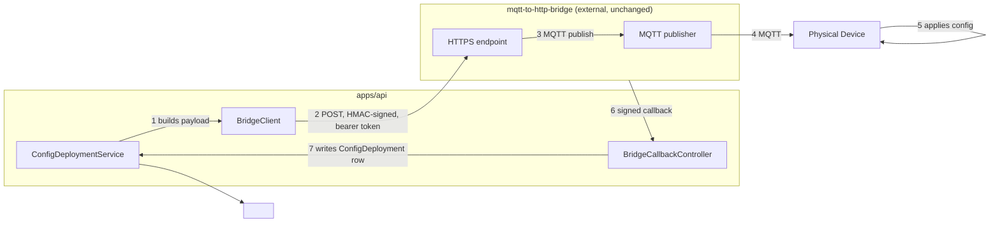
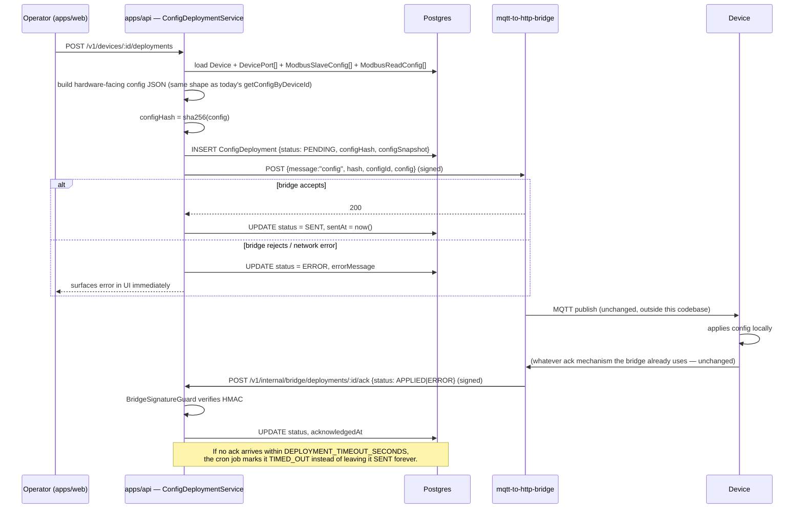

# 11 — Device Communication & Configuration Deployment

## 1. The Boundary, Restated

The backend never opens an MQTT connection and never will. The existing `mqtt-to-http-bridge` service (deployed separately, not part of this repository) is the only thing that speaks MQTT to the field. This is not a default we arrived at — it is an explicit constraint from the business, and it's a good one: it means the backend's deployment, scaling, and failure modes are completely decoupled from broker operations. v2 keeps this boundary exactly where it is and only changes what travels across it (adding authentication in both directions, and adding a history table instead of an overwritten status field).



## 2. What Changes vs. Today, Specifically

| | Today | v2 |
|---|---|---|
| Backend → bridge auth | None visible in code beyond whatever the bridge itself might check; the call is a plain `axios.post` with a JSON body and a 10s timeout | `Authorization: Bearer ${BRIDGE_API_TOKEN}` plus an `X-Signature` HMAC-SHA256 of the body using a shared secret, so the bridge can reject tampered/forged requests even if the bearer token leaked |
| Bridge → backend auth | **None** — `PUT /device/:id/deployment-status` has no auth middleware at all | `POST /v1/internal/bridge/deployments/:id/ack` requires the same HMAC signature scheme, verified by a dedicated `BridgeSignatureGuard` before the controller body runs |
| Endpoint URL | Defaults to a hardcoded single-device path baked into source if the env var is unset | `BRIDGE_BASE_URL` is required at boot (the app fails to start without it, via Nest's config validation) — no silently-wrong fallback is possible |
| Status tracking | One embedded object on `Device`, overwritten every deploy | Append-only `ConfigDeployment` rows; "current status" is a query (`ORDER BY createdAt DESC LIMIT 1`), not a field |
| Stuck deployments | Stay `pending`/`sent` forever if the device never acks | `deployment-timeout.processor` (cron, every minute) flips any `SENT` deployment older than `DEPLOYMENT_TIMEOUT_SECONDS` to `TIMED_OUT` |
| Payload shape | `{ message: "config", hash, configId, config }` | Unchanged — no reason to break the bridge's existing contract; only the transport-level auth around it changes |

## 3. Deployment Sequence (Full)



## 4. Hardware-Facing Config Payload (Unchanged Shape, Carried Forward)

This is read directly from the current `device.service.ts`'s `getConfigByDeviceId` and is preserved exactly, because changing it would require a firmware/bridge-side change that is out of scope for this rebuild:

```json
{
  "device_id": "...",
  "configId": "...",
  "imei": "...",
  "modbusSlaves": [
    {
      "unique_slave_id": "c618ac18-...",
      "slave_id": 1,
      "serial": { "baudRate": 9600, "dataBits": 8, "stopBits": 1, "parity": "none" },
      "polling": { "intervalMs": 1000, "timeoutMs": 300, "retries": 3 },
      "registers": [
        { "readId": "...", "func": "fc_4", "start": 0, "bits": 32 }
      ]
    }
  ]
}
```

## 5. Idempotency & Replay Safety

Each `ConfigDeployment` row stores the exact `configSnapshot` sent. If an operator deploys twice in quick succession with no change, the `configHash` matches the previous deployment's hash; the UI surfaces "no changes since last deploy" and the API can short-circuit (configurable — either still send, for safety, or skip and return the existing row, depending on operational preference). This directly uses the `config-hash.ts` utility that already exists and already works in the current codebase — it's ported, not redesigned.

## 6. Why Not Introduce Direct MQTT or EMQX

Stated for completeness, since it was explicitly ruled out: introducing a broker client into the backend would (a) duplicate operational responsibility the bridge service already owns, (b) couple the backend's deployment/scaling story to broker connection management, and (c) provide no capability the current HTTPS-bridge contract doesn't already provide. There is no requirement in this rebuild that the bridge doesn't already satisfy; the only real gaps were authentication (fixed in §2) and history (fixed via `ConfigDeployment`).
