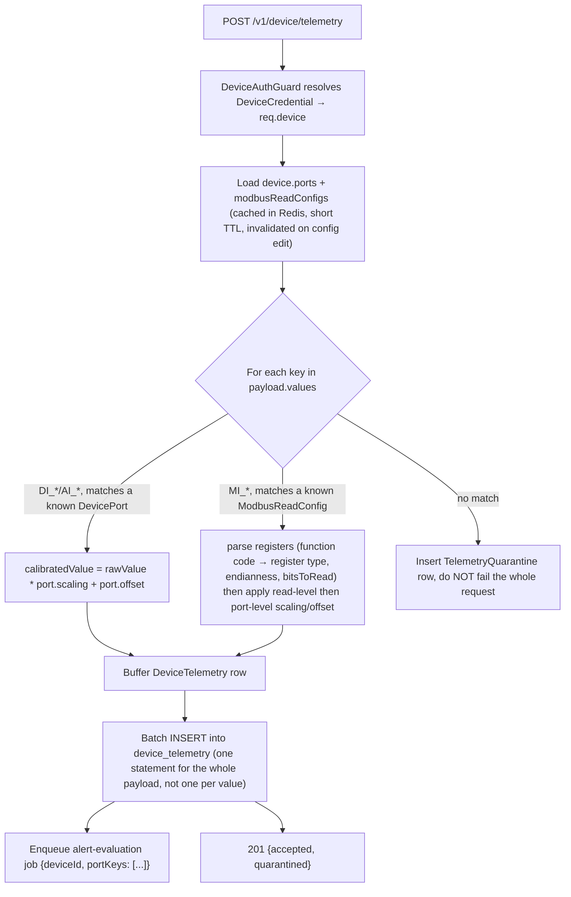

# 12 — Telemetry Flow

## 1. Ingestion Contract (Unchanged Payload Shape, Changed Auth)

Firmware does not need to change. The wire payload is identical to today's:

```json
{
  "ts": "2026-06-25T10:30:00Z",
  "values": {
    "DI_1": 0,
    "DI_2": 1,
    "AI_1": 23.5,
    "AI_2": 1023,
    "MI_1": [
      {
        "slave_id": "c618ac18-3536-4984-90ed-8a178aca662f",
        "registers": [
          { "readId": "c7b3ea49-8e06-459c-ab88-efdfe92a634b", "value": [23223] },
          { "readId": "6573d437-2376-4c1d-806e-8f77998c0850", "value": [101, 102] }
        ]
      }
    ]
  }
}
```

What changes: the request is authenticated with `X-Device-Key: <plaintext device credential>` instead of a borrowed user JWT, and the URL no longer embeds `deviceId` in the path at all — the credential itself identifies the device, exactly like an API key identifies its owner in any machine-to-machine API. (`POST /v1/device/telemetry`, not `POST /v1/devices/:deviceId/telemetry`.) This removes the possibility — present in the current system — of one device's credential being used to post telemetry under a different device's ID.

## 2. Ingestion Pipeline



This is a direct, intentional fix of the existing-system gap where unrecognized `portKey`s were dropped with only a server-side `console.warn` — operators now have a queryable `TelemetryQuarantine` table (and can be alerted if quarantine volume for a device spikes, which usually means a firmware/config mismatch worth investigating).

## 3. Calibration & Modbus Parsing — Ported, Not Redesigned

The current system's transformation logic (`valueTransformation.service.ts`, `utils/transformers/modbusTransformer.ts`) is correct and is carried forward as pure, dependency-free TypeScript functions (`packages` is overkill for something this tightly coupled to the Telemetry module, so it lives at `apps/api/src/telemetry/modbus/modbus-transformer.ts`, unit-tested directly):

- `calibratedValue = rawValue × scaling + offset`, applied at the port level for `DI_*`/`AI_*`, and additionally at the read level (then again at the port level) for Modbus reads — exactly the two-stage calibration already implemented today.
- Function code → register type mapping (`fc_1`→coil, `fc_2`→discrete, `fc_3`→holding, `fc_4`→input) is the same lookup table, now backed by the `ModbusFunctionCode`/`ModbusRegisterType` Postgres enums instead of a plain TS object, but the mapping itself is unchanged.
- Endianness handling (`ABCD`/`CDAB`/`BADC`/`DCBA`/`NONE`) for multi-register values is preserved.

## 4. Query / Read Side

All eight read views from the current `Value` module are preserved 1:1 in `TelemetryQueryService` (latest, by-port, by-modbus-read, stats, table view, snapshot, time-series, time-series-modbus, status summary, export — see `08-api-specifications.md` §6 for exact routes). The only structural change is the storage engine underneath: a `WHERE deviceId = $1 AND ts BETWEEN $2 AND $3` range-partition-pruned query on Postgres instead of a MongoDB time-series collection query — the index design in `05-database-design.md` §9 was chosen specifically to keep these exact access patterns fast.

## 5. Tenant Scoping on Telemetry Reads

Every read endpoint resolves `workspaceId` from `req.activeMembership` (the caller's session) and includes it in the query (`WHERE device_id = $1 AND workspace_id = $2`), even though `device_id` alone would usually be sufficient — this is the defense-in-depth pattern from `07-authorization-rbac-design.md`: tenant scoping lives in the query, not only in a preceding permission check, so a bug in the permission layer cannot, by itself, leak cross-tenant telemetry.

## 6. Rate Limiting & Backpressure

Each `DeviceCredential` has an associated rate limit (Upstash, sliding window, default e.g. 1 request/second per device — generous relative to any sane polling interval seen in the sample Modbus configs, which poll at 1–5 second intervals device-side and batch into one HTTP POST per device tick, not one per register). This protects the ingestion path from a misbehaving or compromised device without needing a queue in front of the ingestion endpoint at current expected scale; `15-scaling-strategy.md` covers what changes if device counts grow far beyond the current product's scale.

## 7. Quality Flag

`quality: GOOD | BAD | UNCERTAIN` is preserved from the current `Value` model's field of the same name/intent. v2 actually populates it meaningfully where the current system declared it but never set it: a Modbus read whose register count doesn't match its declared `bitsToRead`, or a value outside its port's configured `thresholdMin`/`thresholdMax`, is flagged `UNCERTAIN`/`BAD` rather than silently stored as `GOOD`.
