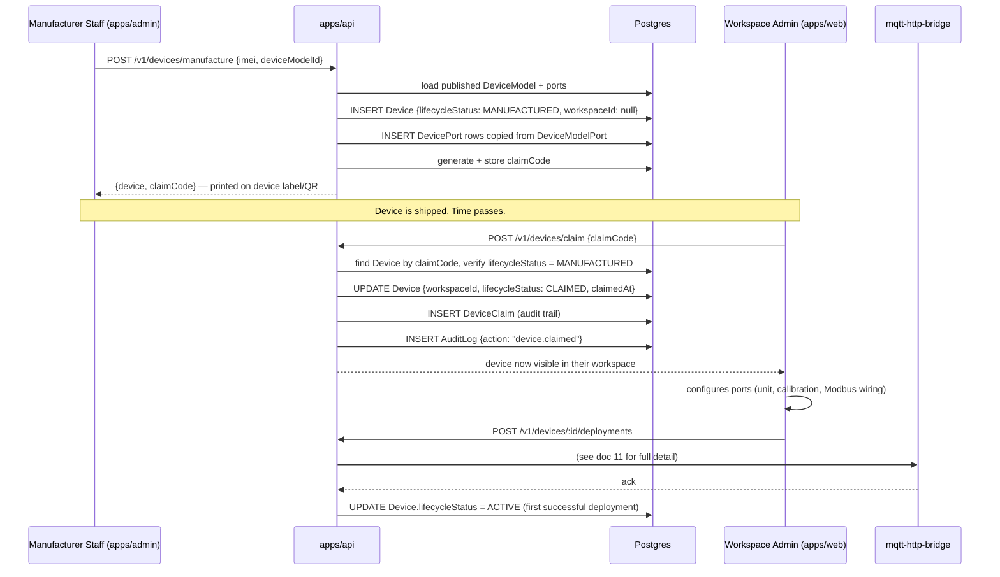
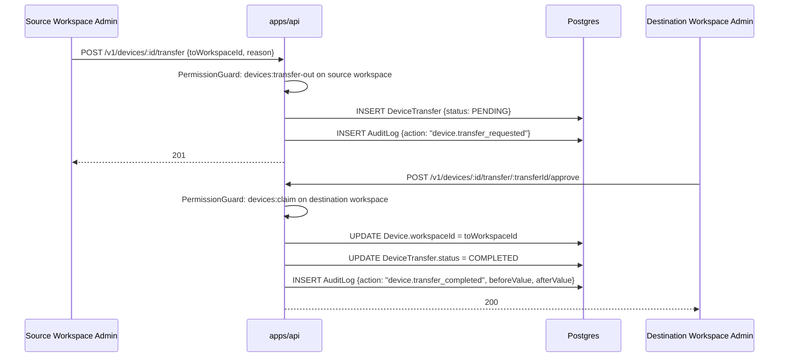
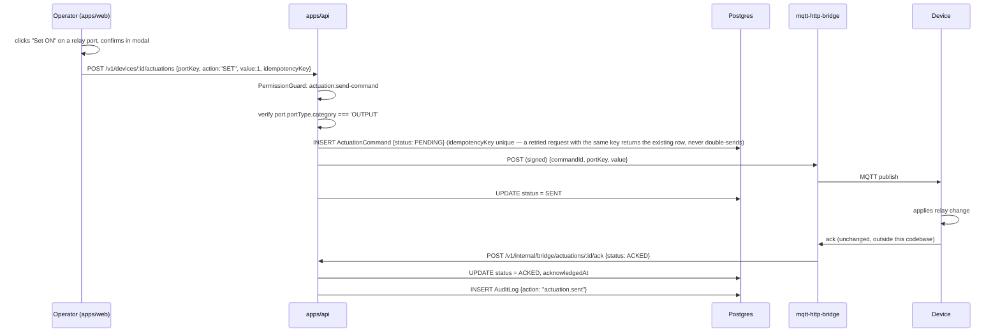
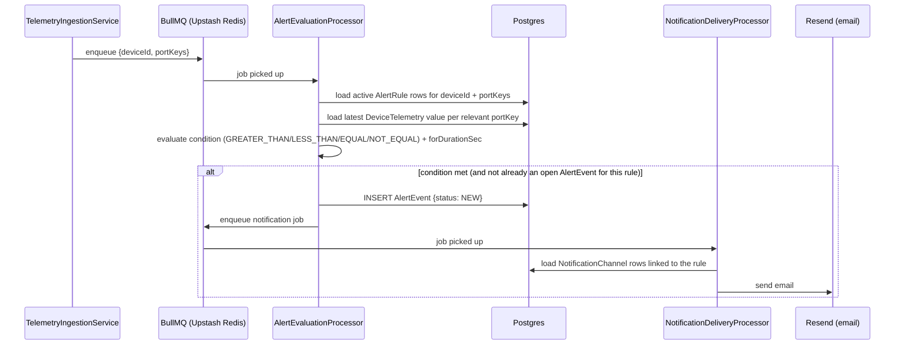
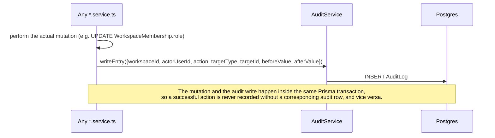
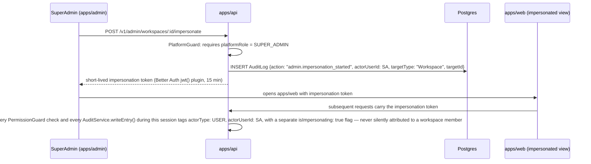

# 13 — Sequence Diagrams (Consolidated)

Flows already fully diagrammed in earlier documents are referenced rather than repeated: B2C sign-up (`06`, §4.1), B2B invitation (`06`, §4.2), device credential issuance + telemetry ingestion auth (`06`, §4.3), config deployment (`11`, §3), telemetry ingestion pipeline (`12`, §2). This document covers the remaining cross-cutting flows.

## 1. Device Manufacture → Claim → First Deployment (End to End)

## 2. Device Transfer Between Workspaces

## 3. Actuation Command

## 4. Alert Rule Evaluation & Notification

## 5. Audit Log Write Path

Every mutating service method that touches a sensitive resource calls the same helper, so the write path is uniform regardless of which module triggered it:

## 6. Admin Impersonation (Support Access)

