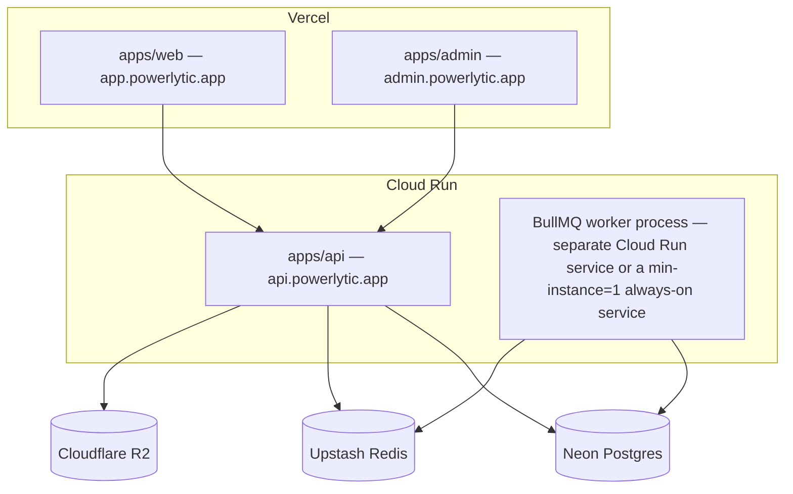

# 16 — Deployment & Environment Guide

## 1. Cloud Services To Create (Exact List)

All of these have a workable free tier as of this writing. Pricing/limits drift over time — verify current numbers on each provider's pricing page before committing, but every one of these has historically maintained a free tier suitable for an early-stage product.

| # | Service | Used For | Free tier (verify current limits) | Sign up at |
|---|---|---|---|---|
| 1 | **Neon** | Primary PostgreSQL database, plus a fresh branch (ephemeral DB) per PR/test run | Generous always-free tier with branching | neon.tech |
| 2 | **Upstash** | Redis (cache, rate limiting, BullMQ queue backend) | Free tier with a fixed daily request allowance | upstash.com |
| 3 | **Vercel** | Hosting for `apps/web` and `apps/admin` (two separate Vercel projects) | Free "Hobby" tier; note Hobby's terms restrict commercial use — move to a paid plan once the product is generating revenue | vercel.com |
| 4 | **Render** (or keep **Google Cloud Run**, since the current system already deploys there) | Hosting for `apps/api` | Render has a free web-service tier (with cold-start sleep) suitable for early development; Cloud Run's free tier (2M requests/month) is generous and the team already has it configured | render.com / console.cloud.google.com |
| 5 | **Cloudflare R2** | Object storage (exported reports, any uploaded assets) | Free egress, generous free storage tier | cloudflare.com |
| 6 | **Resend** | Transactional email (invitations, password reset, alert notifications) | Free tier covers low-volume sending comfortably for an early-stage product | resend.com |
| 7 | **Sentry** | Error tracking, both frontend and backend | Free developer tier | sentry.io |
| 8 | **PostHog** | Product analytics (and optionally feature flags) | Free tier with a generous monthly event allowance | posthog.com |
| 9 | **Google OAuth Client** | Social sign-in via Google | Free — just a Google Cloud project's OAuth consent screen + client ID/secret | console.cloud.google.com |
| 10 | *(Optional)* **Better Stack** (Logtail) | Centralized log search, if stdout logs captured by the host aren't sufficient | Free tier available | betterstack.com |

**Recommendation on #4:** stay on Cloud Run, since the team already has a working Cloud Run deployment for the current backend and migrating hosting providers is unrelated, avoidable risk for this rebuild. Render is listed as the alternative because its free tier requires zero GCP-specific setup if starting completely fresh.

## 2. Local Development — No Docker

The entire point of choosing Neon + Upstash is that local development talks to real, free, cloud-hosted instances of both — there is nothing to install or run locally beyond Node.js and pnpm.

```bash
# One-time setup
nvm install 20 && nvm use 20
npm install -g pnpm
pnpm install

# Get a personal Neon branch for local dev (one command, via the Neon CLI, no Docker)
npx neonctl branches create --name dev-$(whoami)

# Copy env templates and fill in the values from step 3 below
cp apps/api/.env.example apps/api/.env
cp apps/web/.env.example apps/web/.env
cp apps/admin/.env.example apps/admin/.env

# Apply migrations to your branch
pnpm --filter api prisma migrate deploy

# Run everything
pnpm dev   # turbo runs apps/api, apps/web, apps/admin, and the BullMQ worker process together
```

Each developer (and each CI run, and each Vercel/Render preview deployment) gets its **own Neon branch** — a full, isolated copy of the schema (and optionally data) that can be created and destroyed in seconds via the Neon API/CLI. This is the direct mechanism that satisfies "no Docker for local dev" without sacrificing "tests run against a real Postgres, not a mock."

## 3. Environment Variables — Exact List & Source

### `apps/api/.env`

| Variable | Where it comes from | Notes |
|---|---|---|
| `DATABASE_URL` | Neon dashboard → your branch → "Connection string" | Use the pooled connection string for the app; Prisma migrations use the direct (non-pooled) one — Neon's dashboard gives you both. |
| `DIRECT_DATABASE_URL` | Neon dashboard → same branch → direct connection string | Used only by `prisma migrate`. |
| `BETTER_AUTH_SECRET` | Generate yourself: `openssl rand -base64 32` | Never reuse across environments. |
| `BETTER_AUTH_URL` | You set this — the public URL of `apps/api` (e.g. `http://localhost:4000` locally) | |
| `GOOGLE_CLIENT_ID` / `GOOGLE_CLIENT_SECRET` | Google Cloud Console → APIs & Services → Credentials → OAuth client ID (type: Web application) | Redirect URI: `${BETTER_AUTH_URL}/api/auth/callback/google` |
| `UPSTASH_REDIS_REST_URL` / `UPSTASH_REDIS_REST_TOKEN` | Upstash dashboard → your Redis database → REST API section | |
| `RESEND_API_KEY` | Resend dashboard → API Keys | |
| `RESEND_FROM_EMAIL` | You set this, once your sending domain is verified in Resend | |
| `BRIDGE_BASE_URL` | The existing bridge service's base URL — get this from whoever operates the `mqtt-to-http-bridge` service today (it is **not** part of this repo) | Required at boot; app fails to start without it. |
| `BRIDGE_API_TOKEN` | Agreed/shared with the bridge service operator | Bearer token for backend→bridge calls. |
| `BRIDGE_HMAC_SECRET` | Agreed/shared with the bridge service operator | Used to sign outbound calls and verify inbound callbacks. |
| `ALLOWED_ORIGINS` | You set this — comma-separated list, e.g. `https://app.powerlytic.app,https://admin.powerlytic.app` (plus localhost ports in dev) | Replaces the current hardcoded array in `app.ts`. |
| `SENTRY_DSN` | Sentry dashboard → Project Settings → Client Keys | |
| `R2_ACCOUNT_ID` / `R2_ACCESS_KEY_ID` / `R2_SECRET_ACCESS_KEY` / `R2_BUCKET_NAME` | Cloudflare dashboard → R2 → Manage API tokens | Only needed once object storage is actually used by a feature. |
| `DEPLOYMENT_TIMEOUT_SECONDS` | You set this — operational tuning value, e.g. `300` | |
| `NODE_ENV` | `development` / `production`, set by the hosting platform in prod | |
| `PORT` | Set by the hosting platform in prod (Cloud Run sets `PORT` automatically); `4000` locally | |

### `apps/web/.env` and `apps/admin/.env`

| Variable | Where it comes from | Notes |
|---|---|---|
| `NEXT_PUBLIC_API_URL` | The deployed `apps/api` URL (or `http://localhost:4000` locally) | |
| `NEXT_PUBLIC_BETTER_AUTH_URL` | Same as `BETTER_AUTH_URL` above — the auth client needs to know where `/api/auth/*` lives | |
| `NEXT_PUBLIC_SENTRY_DSN` | Sentry dashboard → a separate frontend project (or the same project, different DSN key) | |
| `NEXT_PUBLIC_POSTHOG_KEY` / `NEXT_PUBLIC_POSTHOG_HOST` | PostHog dashboard → Project Settings | |

`apps/admin` additionally sets a distinct cookie domain/audience configuration (no separate env var beyond pointing at its own deployed URL — the audience separation described in `06-authentication-design.md` §4.4 comes from the two apps being on different origins, not from a config flag).

## 4. Production Deployment Topology



## 5. CI/Preview Environments

Every pull request gets:
- A fresh Neon branch (created by a GitHub Action via `neonctl`), migrated automatically.
- A Vercel preview deployment of `apps/web` and `apps/admin`, pointed at a preview deployment of `apps/api` (Cloud Run/Render both support per-branch preview services), pointed at that PR's Neon branch.
- The branch — and its database — is destroyed automatically when the PR closes.

This means **every PR is tested against a real, isolated Postgres database with zero local Docker usage and zero shared-state risk between PRs** — directly satisfying both the "no Docker" and "free tier" constraints while still getting real integration-test fidelity.
