# 18 — CI/CD Recommendations

## 1. Toolchain

GitHub Actions, pnpm + Turborepo's remote caching (free for open-source; Vercel's Remote Cache works for private repos on their platform too) so unaffected packages skip rebuilding/retesting on every PR.

## 2. Pipeline Stages (Pull Request)

```mermaid
flowchart LR
    A["Push / PR opened"] --> B["Install (pnpm, cached)"]
    B --> C["Lint + typecheck (turbo run lint typecheck)"]
    C --> D["Create ephemeral Neon branch"]
    D --> E["Run migrations on branch"]
    E --> F["Unit + integration tests (turbo run test)"]
    F --> G["Build all apps (turbo run build)"]
    G --> H["Deploy preview: Vercel (web, admin) + Cloud Run/Render (api), pointed at the PR's Neon branch"]
    H --> I["Playwright E2E against the preview URLs"]
    I --> J["Generate OpenAPI spec from apps/api build, diff against packages/api-client — fails if backend contract changed without regenerating the client"]
    J --> K["Status checks reported on PR"]
```

On PR close (merged or not): a cleanup job deletes the Neon branch and tears down preview deployments.

## 3. Pipeline Stages (Merge to `main`)

Same as above through the build step, then:
- Apply migrations to the production Neon branch (`prisma migrate deploy`, never `migrate dev`, in CI).
- Deploy `apps/api` to production Cloud Run/Render.
- Deploy `apps/web` and `apps/admin` to production Vercel.
- Tag the release, publish the generated OpenAPI spec as a build artifact.

## 4. Required Checks Before Merge

- Lint, typecheck, unit, integration, and E2E suites all green.
- `pnpm audit` (or Dependabot/Snyk alerts) shows no new high/critical vulnerabilities.
- A lint rule (custom ESLint rule, run in CI) fails the build if any NestJS controller method lacks one of `@RequirePermission`, `@UseGuards(DeviceAuthGuard)`, or an explicit `@Public()` decorator — this is the automated enforcement of "every route is intentionally authorized," directly closing the door on the kind of unreviewed-open-route problem found throughout the existing system.
- API contract check (step J above) passes — the frontend's generated client is never allowed to silently drift from what the backend actually serves.

## 5. Secrets in CI

Stored as GitHub Actions encrypted secrets: `NEON_API_KEY`, `VERCEL_TOKEN`, `CLOUD_RUN`/`RENDER` deploy credentials, `BETTER_AUTH_SECRET` (a CI-only value, distinct from any real environment's), and a dedicated low-traffic Upstash database's credentials for the handful of tests that need real Redis behavior.

## 6. Branch/Environment Strategy

| Branch | Deploys to | Database |
|---|---|---|
| Any PR branch | Preview (Vercel preview, Cloud Run/Render preview revision) | Fresh Neon branch, destroyed on PR close |
| `main` | Production | Production Neon branch |

There is intentionally no separate long-lived "staging" branch/environment in this design — Neon's per-PR branching plus production already covers "test against real infrastructure before merge" and "the real thing after merge" without a third environment to keep in sync. If the team later wants a long-lived staging environment for manual QA between merges and a release cut, it's a small addition (a `staging` branch + a persistent Neon branch for it), not an architectural change.
