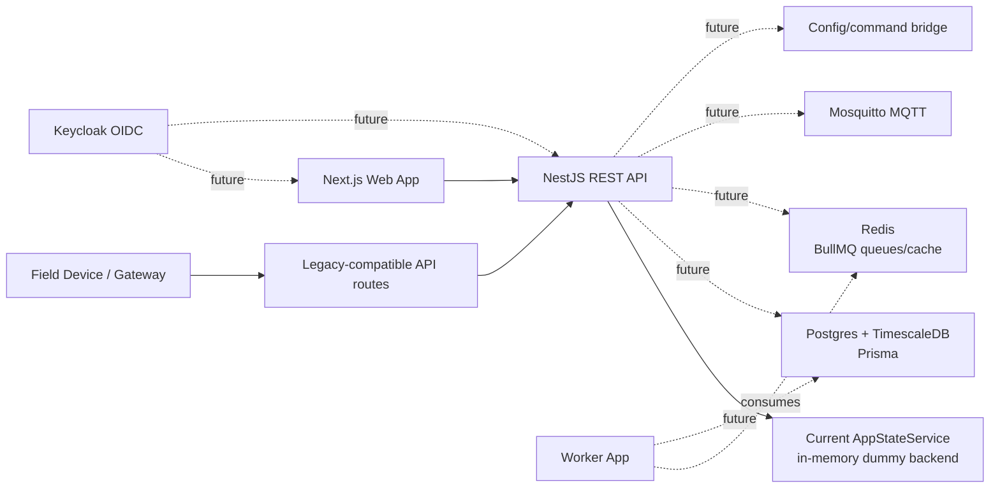
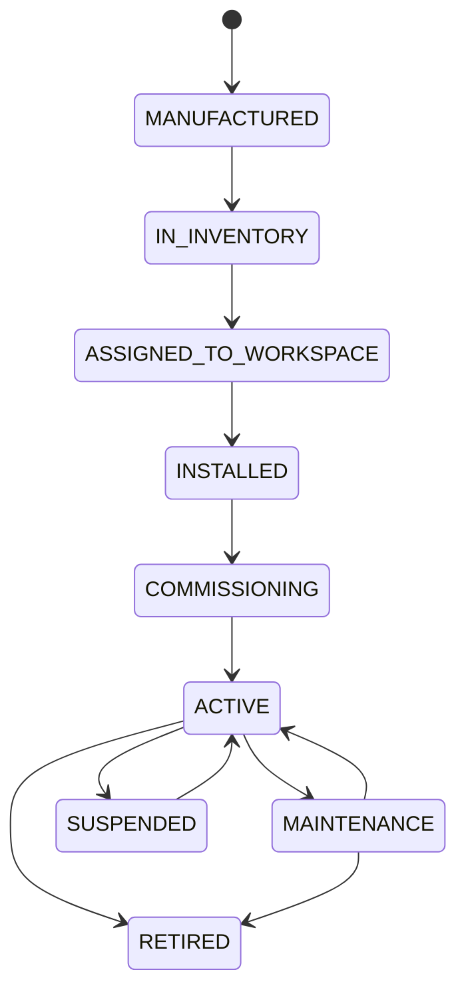
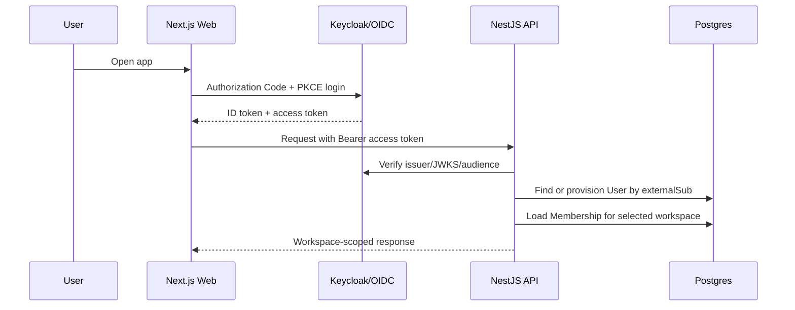
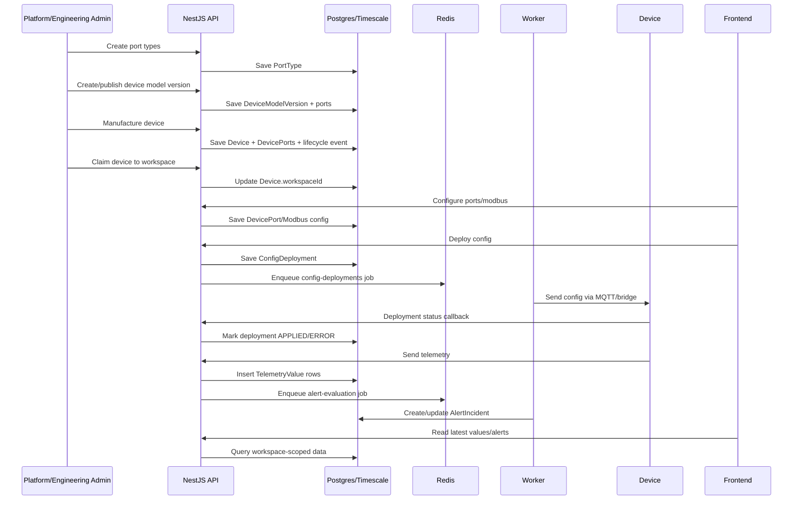
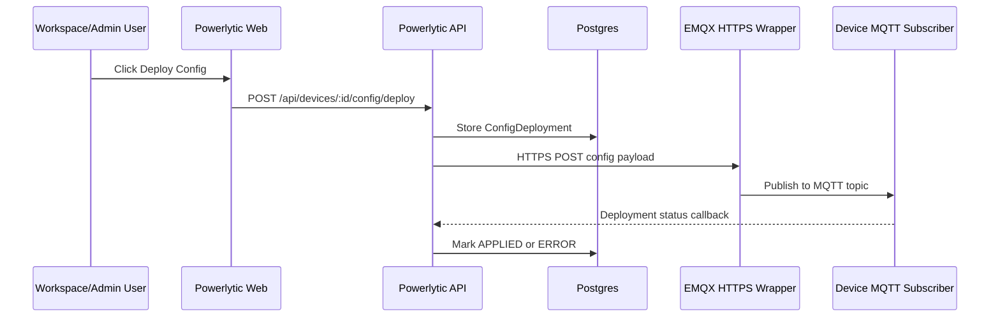

# Powerlytic Current Architecture and Production Readiness

This document explains how the generated Powerlytic codebase is currently connected, how the backend flow works from manufacturing to monitoring, how organizations and RBAC are modeled, how auth is stubbed today, where dummy data lives, and what must be added to make it work with real database-backed and realtime data.

## 1. Current Monorepo Layout

The project is a TypeScript monorepo.

```text
powerlytic-codex/
  apps/
    api/        NestJS REST API
    web/        Next.js frontend
    worker/     BullMQ worker process
  packages/
    authz/      RBAC permission map
    db/         Prisma schema and generated client target
    types/      Shared DTO/enums/contracts
    validators/ Zod request validators
    ui/         Shared UI package placeholder
    config/     Config package placeholder
  infra/
    compose.yaml
    docker/
      keycloak-realm.json
      mosquitto.conf
      init-timescale.sql
  docs/
```

Current important files:

| Area | File |
| --- | --- |
| API bootstrap | `apps/api/src/main.ts` |
| API module wiring | `apps/api/src/app.module.ts` |
| In-memory backend state | `apps/api/src/common/app-state.service.ts` |
| Auth controller | `apps/api/src/auth/auth.controller.ts` |
| Device lifecycle/config controller | `apps/api/src/devices/devices.controller.ts` |
| Legacy device compatibility controller | `apps/api/src/devices/legacy-device.controller.ts` |
| Telemetry controller | `apps/api/src/telemetry/telemetry.controller.ts` |
| RBAC permission table | `packages/authz/src/index.ts` |
| Database schema | `packages/db/prisma/schema.prisma` |
| Worker queues | `apps/worker/src/main.ts` |
| Frontend mock data | `apps/web/lib/mock-data.ts` |

## 2. High-Level Runtime Architecture



Today the API does not persist changes to a database. It keeps seeded arrays inside `AppStateService`. That is useful for demoing routes and UI behavior, but every API restart resets the data.

The Prisma schema, Docker Compose services, and worker process are already scaffolded so the project has the production shape. The next implementation step is replacing `AppStateService` with repositories/services backed by Prisma, TimescaleDB, Redis/BullMQ, and OIDC token verification.

## 3. Current Backend Modules

The API exposes these main domains:

| Domain | Current controller | Responsibility |
| --- | --- | --- |
| Health | `HealthController` | API liveness/readiness checks |
| Auth | `AuthController` | Dev login, refresh, reset stubs, OIDC start/callback hints |
| Users | `UsersController` | User list/create/update/deactivate and legacy registration-style routes |
| Workspaces/Organizations | `WorkspacesController` | Workspace/org CRUD, memberships, invitations |
| Port Types | `PortTypesController` | Port type catalog such as DI, AI, MI, DO |
| Device Models | `DeviceModelsController` | Hardware model versions and model port definitions |
| Devices | `DevicesController` | Manufacture, inventory, claim, update, retire, config, credentials, lifecycle |
| Legacy Devices | `LegacyDeviceController` | Compatibility endpoints for existing hardware/bridge contracts |
| Telemetry | `TelemetryController` | Legacy telemetry ingest and query endpoints |
| Alerts | `AlertsController` | Alert rules and alert incidents |
| Actuations | `ActuationsController` | Device command/actuation requests |
| Audit | `AuditController` | Audit log reads |

## 4. Data Model Overview

The Prisma schema currently models the entities required for production persistence:

| Entity | Purpose |
| --- | --- |
| `User` | Human user identity record, linked to external OIDC subject if real auth is enabled |
| `Workspace` | Tenant boundary, currently used as organization/customer account |
| `Membership` | User-to-workspace role assignment |
| `Invitation` | Pending workspace invite |
| `PortType` | Reusable catalog entry for DI, AI, MI, DO, etc. |
| `DeviceModel` | Product/hardware family |
| `DeviceModelVersion` | Versioned hardware/firmware contract |
| `DeviceModelPort` | Ports available on a model version |
| `Device` | Physical device, IMEI/config ID, owner workspace, lifecycle, health |
| `DevicePort` | Configured port on a physical device |
| `ModbusSlave` | Serial slave configuration under a Modbus port |
| `ModbusRead` | One Modbus register read definition |
| `DeviceCredential` | Per-device API key or machine credential hash |
| `ConfigDeployment` | Config payload sent to device/bridge and deployment status |
| `TelemetryValue` | Stored telemetry row, including analog/digital/modbus parsed fields |
| `AlertRule` | Threshold/comparator rule |
| `AlertIncident` | Triggered alert instance |
| `ActuationCommand` | Command sent to device output/control channel |
| `DeviceLifecycleEvent` | Audit trail of lifecycle state transitions |
| `AuditLog` | Human/system audit trail |

The generated database provider is PostgreSQL. `infra/docker/init-timescale.sql` enables the TimescaleDB extension, intended for telemetry hypertables later.

## 5. Manufacturing to Monitoring Flow

### 5.1 Port Type Setup

Port types define reusable categories for hardware IO.

Examples seeded in memory:

| Port type | Code | Format |
| --- | --- | --- |
| Digital Input | `DI` | `DIGITAL` |
| Analog Input | `AI` | `ANALOG` |
| Modbus Input | `MI` | `MODBUS` |
| Digital Output | `DO` | `DIGITAL` |

Backend path:

```text
POST /api/port-types
GET  /api/port-types
PUT  /api/port-types/:id
POST /api/port-types/:id/deactivate
```

Production use:

1. Platform/engineering admin creates port types.
2. Device model versions reference those port types.
3. Physical devices inherit model ports during manufacture.

### 5.2 Device Model Creation

A device model describes a product family and its supported ports. The model version defines the actual hardware contract.

Backend path:

```text
POST /api/device-models
POST /api/device-models/:modelId/publish
POST /api/device-models/:modelId/new-version
POST /api/device-models/:modelId/deprecate
```

Current behavior:

`AppStateService.createDeviceModel()` generates model ports from selected port types and assigns stable port keys like:

```text
DI_1
AI_1
MI_1
DO_1
```

Production behavior should persist:

1. `DeviceModel`
2. `DeviceModelVersion`
3. `DeviceModelPort`

Published model versions should be immutable. If hardware changes, create a new model version rather than editing a published version.

### 5.3 Manufacturing Devices

Manufacturing creates a physical device inventory record.

Backend path:

```text
POST /api/devices/manufacture
GET  /api/devices/inventory
```

Current in-memory behavior:

1. API receives IMEI, serial number, model version, firmware/hardware details.
2. It creates a `DeviceDto`.
3. It generates a random `configId`.
4. It copies model ports onto the device as physical `ports`.
5. It sets lifecycle to `IN_INVENTORY`.
6. It writes an audit event in memory.

Production behavior should write:

1. `Device`
2. `DevicePort` rows copied from `DeviceModelPort`
3. Optional `DeviceCredential` factory key
4. `DeviceLifecycleEvent` from `MANUFACTURED` to `IN_INVENTORY`
5. `AuditLog`

Recommended production lifecycle:



### 5.4 Claiming Devices into an Organization

Claiming connects an inventory device to a customer organization/workspace.

Backend path:

```text
POST /api/devices/claim
POST /api/devices/:deviceId/transfer
```

Current behavior:

1. API finds the device by claim code/config ID or IMEI.
2. It sets `workspaceId`.
3. It updates the display name if provided.
4. It changes lifecycle to `ASSIGNED_TO_WORKSPACE`.
5. It writes an audit event.

Production behavior should additionally:

1. Validate the caller has `device:claim` on the target workspace.
2. Prevent claiming a device already assigned unless transfer is explicitly allowed.
3. Write a `DeviceLifecycleEvent`.
4. Write an `AuditLog`.
5. Optionally rotate factory credential into workspace-owned device credential.

### 5.5 Device Configuration

Configuration translates the backend device model/device port setup into the payload expected by hardware or a bridge.

Modern backend paths:

```text
GET  /api/devices/:deviceId/config
POST /api/devices/:deviceId/config/deploy
GET  /api/devices/:deviceId/config/deployments
PUT  /api/devices/:deviceId/config/deployments/current/status
```

Legacy-compatible paths:

```text
GET  /api/device/:id/config
POST /api/device/:id/deploy
GET  /api/device/:id/deployment-status
PUT  /api/device/:id/deployment-status
```

The legacy config response currently keeps this hardware-friendly shape:

```json
{
  "device_id": "dev-demo-1",
  "configId": "cfg-demo-1",
  "imei": "867530900001",
  "modbusSlaves": []
}
```

The deployment payload shape is:

```json
{
  "message": "config",
  "hash": "sha256 hash",
  "configId": "cfg-demo-1",
  "config": {}
}
```

Production behavior should:

1. Build config from `Device`, `DevicePort`, `ModbusSlave`, and `ModbusRead`.
2. Hash the canonical JSON config.
3. Persist `ConfigDeployment` with `PENDING` or `SENT`.
4. Enqueue a `config-deployments` BullMQ job or publish to MQTT/bridge.
5. Mark deployment `SENT` when accepted by the bridge.
6. Accept device/bridge callback and mark `APPLIED` or `ERROR`.
7. Supersede older pending deployments for the same device.

### 5.6 Telemetry Ingest and Monitoring

Telemetry enters through a legacy-compatible endpoint and is transformed into normalized rows.

Backend paths:

```text
POST /api/values/devices/:deviceId
POST /api/telemetry/devices/:deviceId/values
GET  /api/devices/:deviceId/values
GET  /api/devices/:deviceId/values/latest
GET  /api/devices/:deviceId/values/snapshot
GET  /api/devices/:deviceId/values/table
GET  /api/devices/:deviceId/values/timeseries/:portKey
GET  /api/devices/:deviceId/values/timeseries/modbus/:readId
GET  /api/devices/:deviceId/values/stats/:portKey
GET  /api/devices/:deviceId/values/status
GET  /api/devices/:deviceId/values/export
```

Expected legacy payload shape:

```json
{
  "deviceId": "dev-demo-1",
  "ts": "2026-06-21T03:30:00.000Z",
  "values": {
    "DI_1": 1,
    "AI_1": 42.5,
    "MI_1": [
      {
        "slave_id": 1,
        "registers": [
          {
            "readId": "read-voltage-l1",
            "value": [230]
          }
        ]
      }
    ]
  }
}
```

Current behavior:

1. API finds the device.
2. It confirms the device has a workspace.
3. It loops through `payload.values`.
4. It maps `DI_*` to digital, `AI_*` to analog, `MI_*` to modbus.
5. It applies analog scaling/offset.
6. It parses Modbus register arrays into rows with `readId`, `slaveId`, `rawRegisters`, and `parsedValue`.
7. It pushes rows into the in-memory telemetry array.

Production behavior should:

1. Authenticate the device using `DeviceCredential`.
2. Validate that the submitted `deviceId`, IMEI, or config ID matches the credential.
3. Persist rows to `TelemetryValue`.
4. Use TimescaleDB hypertables for `TelemetryValue` because this table will grow quickly.
5. Update `Device.lastSeenAt` and `Device.healthStatus`.
6. Enqueue alert evaluation jobs into Redis/BullMQ.
7. Optionally publish live updates to frontend via WebSocket, SSE, or MQTT-over-WebSocket.

## 6. Organization / Workspace Model

The code treats `Workspace` as the tenant boundary. An organization is represented by a workspace with `kind = ORGANIZATION`.

Current routes:

```text
GET  /api/workspaces
POST /api/workspaces
GET  /api/workspaces/:workspaceId
GET  /api/workspaces/:workspaceId/memberships
POST /api/workspaces/:workspaceId/invitations
GET  /api/workspaces/:workspaceId/invitations
DELETE /api/workspaces/:workspaceId/memberships/:membershipId

GET  /api/organizations
POST /api/organizations
GET  /api/organizations/:orgId
```

Organization ownership works like this:

1. A `Workspace` represents a company/customer/org.
2. A `User` can belong to one or more workspaces.
3. `Membership` connects a user to a workspace and assigns a role.
4. `Device.workspaceId` determines which organization owns/operates the device.
5. Alerts, telemetry, audit logs, and actuations should always be scoped by workspace.

In production, every data read should be workspace-scoped unless the caller is a platform-level `SUPER_ADMIN` or engineering role with explicit permission.

## 7. RBAC Model

RBAC is defined in `packages/authz/src/index.ts`.

Roles:

| Role | Intended user |
| --- | --- |
| `SUPER_ADMIN` | Powerlytic platform admin |
| `ENGINEERING_ADMIN` | Internal engineering/admin team managing models and hardware |
| `MANUFACTURER` | Manufacturing/inventory team |
| `WORKSPACE_ADMIN` | Customer org admin |
| `OPERATOR` | Customer operator who monitors and sends allowed commands |
| `VIEWER` | Read-only customer user |

Permissions:

| Permission | Meaning |
| --- | --- |
| `workspace:read` | View workspace/org data |
| `workspace:manage` | Update workspace/org details |
| `membership:manage` | Invite/remove users |
| `device_model:read` | View model catalog |
| `device_model:manage` | Create/publish/deprecate model versions |
| `device:manufacture` | Create factory inventory devices |
| `device:read` | View devices |
| `device:manage` | Update/retire/transfer devices |
| `device:claim` | Claim inventory device into workspace |
| `device:deploy_config` | Deploy config to device |
| `telemetry:read` | Read telemetry |
| `telemetry:ingest` | Submit telemetry |
| `alert:manage` | Manage alert rules/incidents |
| `actuation:create` | Create device command |
| `actuation:approve` | Approve command if approval flow is added |
| `audit:read` | Read audit events |

Current status:

The RBAC permission table exists, but the API controllers do not yet enforce it with guards. The generated backend is permissive/demo mode.

Production implementation needed:

1. Add NestJS auth guard to verify JWT access tokens.
2. Load user by OIDC `sub` or email.
3. Resolve active workspace membership.
4. Add route decorators such as `@RequirePermission(Permission.DEVICE_MANAGE)`.
5. Add workspace/device ownership checks inside services.
6. Reject cross-workspace access.
7. Write audit logs for privileged actions.

## 8. Auth Model

### Current Auth

`AuthController` currently has development stubs:

```text
GET  /api/auth/me
POST /api/auth/login
POST /api/auth/refresh
POST /api/auth/request-reset
POST /api/auth/reset-password
POST /api/auth/logout
GET  /api/auth/oidc/:provider/start
GET  /api/auth/oidc/:provider/callback
```

Current behavior:

1. `POST /api/auth/login` looks up a user by email in memory.
2. It returns fake tokens like `dev-access-usr-admin`.
3. Passwords are not checked.
4. JWTs are not verified.
5. OIDC endpoints return hints, not a complete login flow.

### Intended Production Auth

The infrastructure includes a Keycloak realm at:

```text
infra/docker/keycloak-realm.json
```

It defines:

1. Realm: `powerlytic`
2. Public frontend client: `powerlytic-web`
3. Bearer-only API client: `powerlytic-api`
4. Realm roles matching backend roles

Recommended production flow:



Production implementation needed:

1. Use NextAuth/Auth.js or an OIDC client in the web app.
2. Use Authorization Code + PKCE for browser login.
3. API verifies JWT signature using issuer JWKS.
4. API checks `aud`, `iss`, expiry, and active user state.
5. Store Keycloak subject in `User.externalSub`.
6. Map realm/client roles into workspace memberships or keep app roles in DB.
7. Replace fake refresh/reset flows with OIDC-supported flows or secure app-owned flows.

## 9. Device Authentication

Human auth and device auth should be separate.

Current status:

The schema has `DeviceCredential`, and the in-memory service has a seeded demo credential. The API does not yet require device credentials during telemetry ingest.

Recommended production approach:

1. During manufacturing or claiming, create a device API key once.
2. Store only `keyHash` in `DeviceCredential`.
3. Device sends key in a header such as:

```text
Authorization: Device <raw-secret>
```

or:

```text
X-Device-Key: <raw-secret>
```

4. API hashes the submitted secret and matches active `DeviceCredential`.
5. Rotate keys by creating a new credential and revoking the old one.
6. Update `lastUsedAt`.
7. Log failed auth attempts separately from normal audit logs.

## 10. Alerts

Current alert routes:

```text
GET  /api/alert-rules
POST /api/alert-rules
GET  /api/alert-rules/:id
PUT  /api/alert-rules/:id
POST /api/alert-rules/:id/deactivate
GET  /api/alert-incidents
GET  /api/alert-incidents/:id
POST /api/alert-incidents/:id/ack
POST /api/alert-incidents/:id/resolve
```

Current behavior:

Alert rules and incidents are stored in memory. Alert evaluation is not yet connected to telemetry ingest.

Production behavior:

1. When telemetry is ingested, enqueue `alert-evaluation` job into Redis/BullMQ.
2. Worker loads active `AlertRule` rows for the workspace/device/port/read.
3. Worker evaluates comparator, threshold, and duration window.
4. Worker creates or updates `AlertIncident`.
5. Worker sends notifications through email/SMS/webhook.
6. API supports acknowledge/resolve workflows.
7. Audit logs record rule changes and incident actions.

## 11. Actuations

Actuations represent commands from a human/operator to a physical device output or bridge.

Current routes:

```text
GET  /api/devices/:deviceId/actuations
POST /api/devices/:deviceId/actuations
GET  /api/devices/:deviceId/actuations/:actuationId
POST /api/devices/:deviceId/actuations/:actuationId/cancel
POST /api/devices/:deviceId/actuations/:actuationId/retry
```

Current behavior:

Commands are stored in memory and not sent to MQTT/bridge.

Production behavior:

1. Validate `actuation:create` permission.
2. Optionally require `actuation:approve` for dangerous commands.
3. Persist `ActuationCommand`.
4. Enqueue command delivery job or publish to MQTT.
5. Use `idempotencyKey` to avoid duplicate commands.
6. Update command status from device/bridge acknowledgement.
7. Audit all command actions.

## 12. Redis Usage

Redis is included in `infra/compose.yaml` and used by the worker package through BullMQ.

Current worker file:

```text
apps/worker/src/main.ts
```

Current queues:

| Queue | Current behavior | Intended production behavior |
| --- | --- | --- |
| `config-deployments` | Logs job data and returns `{ ok: true }` | Deliver config to bridge/MQTT/device, update deployment status |
| `alert-evaluation` | Logs job data and returns `{ ok: true }` | Evaluate telemetry against alert rules and create incidents |

Important: the API currently does not enqueue jobs into Redis. Redis is scaffolded, not fully integrated.

Recommended Redis/BullMQ usage:

1. Add a queue producer module in `apps/api`.
2. On config deployment, write `ConfigDeployment`, then enqueue `config-deployments`.
3. On telemetry ingest, write `TelemetryValue`, then enqueue `alert-evaluation`.
4. On actuation, write `ActuationCommand`, then enqueue `actuation-delivery`.
5. Add retry/backoff/dead-letter policies.
6. Add dashboard/monitoring for failed jobs.

## 13. MQTT / Realtime Transport

Mosquitto is included in Docker Compose but not yet integrated by the API.

Current infra:

```text
infra/docker/mosquitto.conf
```

It exposes:

```text
1883  MQTT
9001  MQTT over WebSocket
```

Recommended production topics:

```text
powerlytic/devices/{deviceId}/telemetry
powerlytic/devices/{deviceId}/config
powerlytic/devices/{deviceId}/config/status
powerlytic/devices/{deviceId}/commands
powerlytic/devices/{deviceId}/commands/status
```

Two possible ingest modes:

1. HTTP ingest: device posts telemetry to `/api/values/devices/:deviceId`.
2. MQTT ingest: device publishes telemetry to MQTT; a backend consumer validates and writes to DB.

For realtime frontend monitoring:

1. API can expose WebSocket/SSE to browser.
2. Worker/API can publish updates after telemetry insert.
3. Frontend React Query can continue polling initially, then move to live subscriptions.

## 14. Frontend Data Status

The frontend currently uses dummy UI data from:

```text
apps/web/lib/mock-data.ts
```

This is separate from API in-memory data. That means frontend pages render even if the API is not running, but they are not yet connected to real backend responses.

To connect frontend to real API:

1. Replace imports from `mock-data.ts` with calls through `apps/web/lib/api.ts`.
2. Add server-side fetches in Next.js pages where data is read-only.
3. Add client-side mutations for create/update actions.
4. Wire modal forms to `fetch()` or React Query mutations.
5. Add loading, error, empty, and permission states.
6. Add auth session handling and pass bearer token to API calls.
7. Remove hardcoded demo values once API and DB seed data exist.

Suggested route mapping:

| Frontend page | Backend API |
| --- | --- |
| `/login` | OIDC provider / `/api/auth/me` |
| `/dashboard` | aggregate API endpoint to add |
| `/devices` | `GET /api/devices` |
| `/devices/[deviceId]` | `GET /api/devices/:deviceId` |
| `/devices/[deviceId]/configure` | `GET/PATCH /api/devices/:deviceId`, `GET /config`, `POST /config/deploy` |
| `/devices/[deviceId]/values` | `GET /api/devices/:deviceId/values` |
| `/devices/[deviceId]/deployments` | `GET /api/devices/:deviceId/config/deployments` |
| `/device-models` | `GET /api/device-models` |
| `/port-types` | `GET /api/port-types` |
| `/organizations` | `GET /api/workspaces` or `GET /api/organizations` |
| `/users` | `GET /api/users` |
| `/telemetry` | telemetry query endpoints |
| `/alerts` | alert rules/incidents endpoints |
| `/actuations` | actuation endpoints |
| `/audit` | `GET /api/audit-logs` |

## 15. What Is Dummy Today

These parts are demo/stubbed:

| Area | Current status |
| --- | --- |
| Backend persistence | In-memory arrays in `AppStateService` |
| Frontend page data | Static arrays in `apps/web/lib/mock-data.ts` |
| Human auth | Fake login tokens; no password/JWT verification |
| OIDC | Keycloak config exists, API/web integration is not complete |
| RBAC enforcement | Permission map exists, guards are not wired |
| Device auth | Schema exists, telemetry ingest does not require credential |
| Redis | Worker consumes queues, API does not enqueue jobs yet |
| MQTT | Mosquitto config exists, API/worker do not publish/subscribe yet |
| Config delivery | Deployment payload is created, not sent to real bridge |
| Alerts | Rules/incidents exist, automatic evaluation is not connected |
| Actuations | Commands are recorded in memory, not delivered to devices |
| Realtime UI | Not connected; pages use mock data |
| Audit | In-memory audit list only |

## 16. Steps to Make It Production-Backed

### Phase 1: Database Persistence

1. Start Postgres/Timescale:

```bash
cd infra
docker compose up -d postgres
```

2. Set `DATABASE_URL`.
3. Run Prisma migration:

```bash
pnpm --filter @powerlytic/db db:migrate
pnpm --filter @powerlytic/db db:generate
```

4. Add a Prisma service in `apps/api`.
5. Replace `AppStateService` with domain services:

```text
WorkspaceService
UserService
PortTypeService
DeviceModelService
DeviceService
TelemetryService
AlertService
ActuationService
AuditService
```

6. Make every write transactional where related rows are created together.
7. Add seed script for platform admin, base port types, demo model, and demo device.

### Phase 2: Auth and RBAC

1. Start Keycloak:

```bash
cd infra
docker compose up -d keycloak
```

2. Configure web app OIDC login.
3. Add API JWT guard using Keycloak JWKS.
4. Store users in Postgres with `externalSub`.
5. Resolve active workspace membership from request context.
6. Add `@RequirePermission()` decorators and guards.
7. Add workspace ownership checks for all device/telemetry/alert/actuation routes.

### Phase 3: Device Credentials

1. Generate device secrets during manufacturing or claiming.
2. Hash and store in `DeviceCredential.keyHash`.
3. Add telemetry/device auth guard.
4. Reject telemetry from inactive, retired, or mismatched devices.
5. Update credential `lastUsedAt` and device `lastSeenAt`.

### Phase 4: Telemetry Storage

1. Persist telemetry to `TelemetryValue`.
2. Convert `TelemetryValue` into a Timescale hypertable.
3. Add retention/compression policy.
4. Add indexes for common queries:

```text
(deviceId, ts)
(workspaceId, ts)
(deviceId, portKey, ts)
(deviceId, readId, ts)
```

5. Implement aggregation endpoints for dashboard charts.
6. Add export streaming for CSV instead of loading huge datasets in memory.

### Phase 5: Redis and Workers

1. Start Redis:

```bash
cd infra
docker compose up -d redis
```

2. Add BullMQ producers in API.
3. Enqueue config deployments, alert evaluations, and actuation deliveries.
4. Make workers update DB status rows.
5. Add retries, backoff, and failed job monitoring.

### Phase 6: MQTT / Bridge

1. Start Mosquitto:

```bash
cd infra
docker compose up -d mosquitto
```

2. Decide whether devices use HTTP, MQTT, or both.
3. Implement config publish path:

```text
API -> Redis job -> Worker -> MQTT/Bridge -> Device
```

4. Implement status callback path:

```text
Device -> MQTT/Bridge -> API/Worker -> ConfigDeployment status
```

5. Implement actuation delivery and acknowledgement.

### Phase 7: Frontend API Integration

1. Replace `mock-data.ts` usage with API fetches.
2. Add authenticated request helper.
3. Wire forms and modals to API mutations.
4. Add RBAC-aware navigation and disabled actions.
5. Add realtime telemetry updates using polling first, then WebSocket/SSE/MQTT.
6. Add realistic error states.

## 17. Recommended Backend Service Boundaries

The current `AppStateService` is intentionally simple, but for production it should be split.

Recommended structure:

```text
apps/api/src/
  auth/
    auth.controller.ts
    jwt-auth.guard.ts
    current-user.decorator.ts
  authorization/
    require-permission.decorator.ts
    permission.guard.ts
  prisma/
    prisma.service.ts
  workspaces/
    workspaces.controller.ts
    workspaces.service.ts
  users/
    users.controller.ts
    users.service.ts
  device-models/
    device-models.controller.ts
    device-models.service.ts
  devices/
    devices.controller.ts
    devices.service.ts
    device-config.service.ts
    device-credentials.service.ts
  telemetry/
    telemetry.controller.ts
    telemetry.service.ts
    telemetry-transformer.ts
  alerts/
    alerts.controller.ts
    alerts.service.ts
  actuations/
    actuations.controller.ts
    actuations.service.ts
  audit/
    audit.controller.ts
    audit.service.ts
  queues/
    queues.module.ts
    queue-producer.service.ts
```

## 18. End-to-End Production Flow



## 19. Minimum Checklist Before Real Customer Use

Use this checklist before considering the platform production-ready:

- [ ] Replace `AppStateService` arrays with Prisma-backed services.
- [ ] Create and run database migrations.
- [ ] Seed required base data.
- [ ] Connect frontend pages to API instead of `mock-data.ts`.
- [ ] Implement OIDC login in web app.
- [ ] Verify JWTs in API.
- [ ] Enforce RBAC permissions on every protected route.
- [ ] Enforce workspace scoping on every query.
- [ ] Add device credential authentication for telemetry/config callbacks.
- [ ] Persist telemetry to TimescaleDB.
- [ ] Add Redis queue producers in API.
- [ ] Implement worker jobs for config deployment and alert evaluation.
- [ ] Decide and implement HTTP/MQTT/bridge transport.
- [ ] Implement alert notification delivery.
- [ ] Implement actuation delivery and acknowledgement.
- [ ] Add audit logs for all privileged writes.
- [ ] Add integration tests for manufacturing, claiming, config deployment, telemetry ingest, alerts, and RBAC.
- [ ] Add observability: structured logs, metrics, traces, failed job monitoring.
- [ ] Add backups and retention policy for Postgres/Timescale.

## 20. Current Honest Status

The generated codebase is a strong architectural scaffold. It has the correct modules, entity model, route contracts, legacy compatibility routes, frontend page coverage, Prisma schema, and infra placeholders. It is not yet a real production backend because persistence, OIDC verification, RBAC guards, Redis producers, MQTT/bridge delivery, and frontend API integration are still stubbed or demo-mode.

The main next step is to replace the in-memory `AppStateService` with Prisma-backed services while preserving the existing route contracts. After that, wire auth/RBAC and realtime pipelines in layers.

## 21. Current Security Update

The backend now has a production-mode security path:

```text
Request -> JwtAuthGuard -> PermissionGuard -> ProductionStateService tenant filters -> Prisma
```

When `AUTH_REQUIRED=false`, the API runs in demo mode with a seeded `SUPER_ADMIN` request context. This is for local development only.

When `AUTH_REQUIRED=true`, the API does the following:

1. Verifies the Bearer token with the configured OIDC issuer.
2. Finds the user in Postgres by `externalSub` or email.
3. Loads active workspace memberships.
4. Selects the workspace from `X-Workspace-Id`.
5. Rejects access if the user is not a member of that workspace.
6. Applies route permission checks.
7. Applies service-level tenant filters before querying Prisma.

This means organization users cannot access another organization's data just by changing a `workspaceId` query/body/header value.

Platform-level roles:

```text
SUPER_ADMIN
ENGINEERING_ADMIN
MANUFACTURER
```

These can access platform/manufacturing workflows.

Workspace-level roles:

```text
WORKSPACE_ADMIN
OPERATOR
VIEWER
```

These are scoped to the user's active membership workspaces.

## 22. Device Authentication Update

The API now supports device credentials separately from human login.

Human requests use:

```http
Authorization: Bearer <OIDC access token>
X-Workspace-Id: <workspace id>
```

Device requests use:

```http
Authorization: Device <device secret>
```

or:

```http
X-Device-Key: <device secret>
```

The backend checks:

1. Device credential hash exists.
2. Credential is active.
3. Credential belongs to a device.
4. Telemetry/config callback is for that exact device.
5. Data is stored under the device's workspace.

This avoids mixing human auth and machine auth.

## 23. EMQX HTTPS Wrapper Flow

Direct MQTT publishing exists but can stay disabled.

For the current expected setup, use the existing EMQX HTTPS wrapper:



Use:

```env
CONFIG_BRIDGE_DIRECT=true
CONFIG_BRIDGE_URL=https://your-wrapper-host/path
CONFIG_BRIDGE_TOKEN=your-token-if-needed
MQTT_ENABLED=false
QUEUE_ENABLED=false
```

If later the worker should deliver config instead of the API, set:

```env
QUEUE_ENABLED=true
CONFIG_BRIDGE_DIRECT=false
```

and run:

```bash
pnpm --filter @powerlytic/worker start
```

## 24. OTP / MFA Decision

Do not build custom OTP into the app first.

Use Keycloak for:

- email verification
- password reset
- admin MFA/OTP
- optional SMS/phone verification if required

Recommended production policy:

| User type | MFA/OTP |
| --- | --- |
| SUPER_ADMIN | Required |
| ENGINEERING_ADMIN | Required |
| WORKSPACE_ADMIN | Required |
| OPERATOR | Optional but recommended |
| VIEWER | Optional |
| Device | Never use OTP; use device credentials |

Phone verification is only necessary if phone numbers are used for SMS alerts, SMS login, or compliance. Email verification is recommended for all human users.

## 25. Updated Remaining Work

The backend security, tenant checks, Prisma path, device credential path, Redis worker, and HTTPS bridge path are now implemented structurally and compile.

Remaining integration work that needs your real provider values:

- Configure Keycloak SMTP and production realm/client settings.
- Add frontend OIDC session handling so the login page gets a real token.
- Link Keycloak users to database users through `externalSub`.
- Set the real Postgres/Timescale `DATABASE_URL`.
- Run migrations and seeds in the real database.
- Set `DEVICE_API_KEY_PEPPER` to a real secret.
- Set your EMQX wrapper `CONFIG_BRIDGE_URL` and token.
- Confirm the exact JSON shape your wrapper expects.
- Wire every frontend modal form to API mutations; current critical pages render and some pages fetch API data, but several forms are still UI-only.
