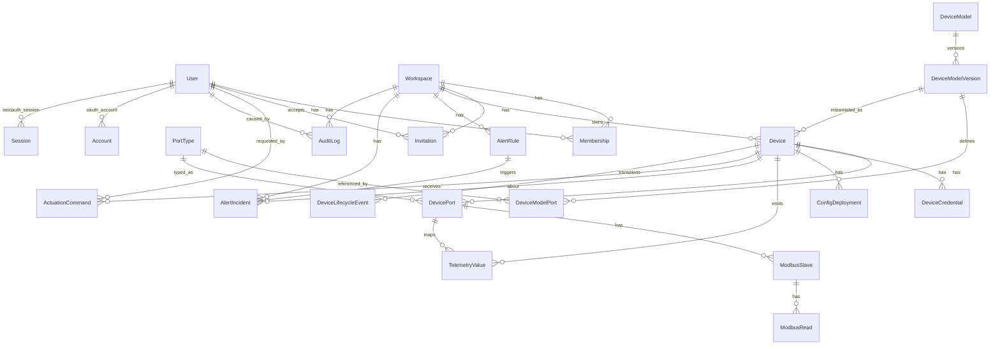

# Entity Relationships (Prisma)

The source of truth is `packages/db/prisma/schema.prisma`.

## 1. ER Diagram

## 2. Core Domain Groups

### Identity and tenancy

- `User`, `Workspace`, `Membership`, `Invitation`
- Multi-tenant access is workspace-scoped and role-based.

### Hardware catalog and fleet

- `PortType`, `DeviceModel`, `DeviceModelVersion`, `DeviceModelPort`
- `Device`, `DevicePort`, `ModbusSlave`, `ModbusRead`

### Operations and observability

- `ConfigDeployment`, `TelemetryValue`
- `AlertRule`, `AlertIncident`
- `ActuationCommand`, `DeviceLifecycleEvent`, `AuditLog`

### Web authentication tables

- `Account`, `Session`, `VerificationToken` (NextAuth adapter)

## 3. Relationship Notes

- A user can belong to many workspaces; a workspace has many users through memberships.
- A device model has many versions; each version defines immutable port structure.
- A physical device references one model version and can be assigned to one workspace.
- Telemetry rows are linked to device and optionally to device port/read metadata.
- Alerts may be global per workspace or specific to one device/port/read.
- Actuations are idempotent per `(deviceId, idempotencyKey)`.
