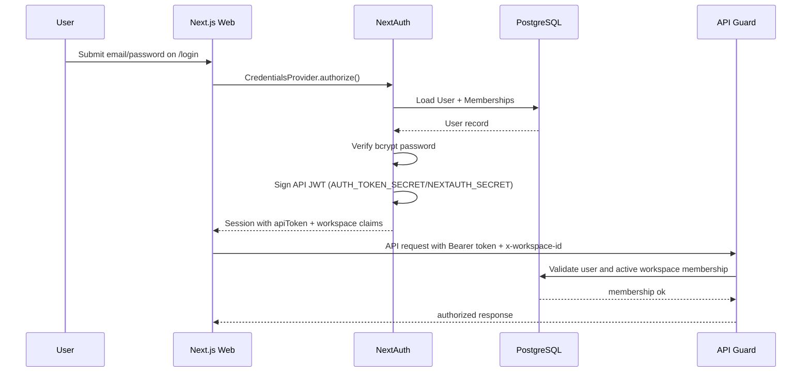
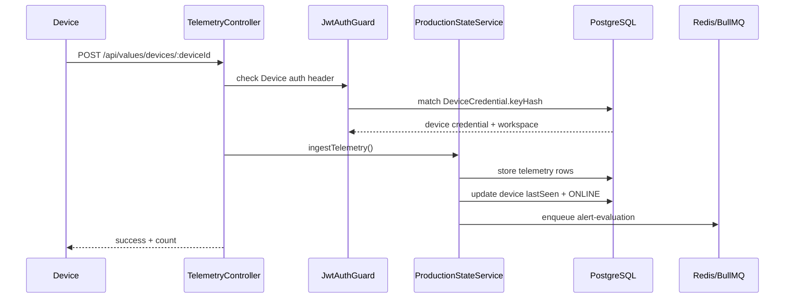
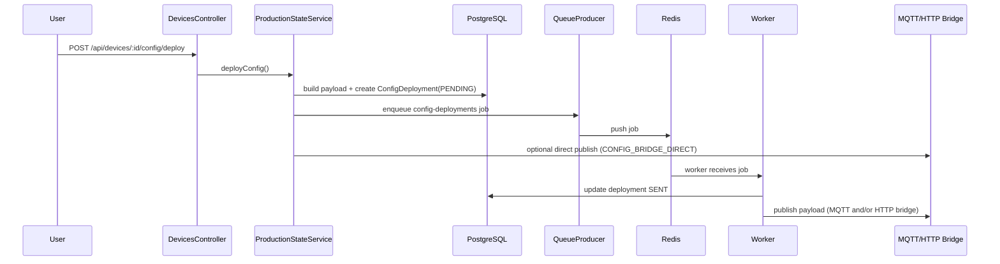
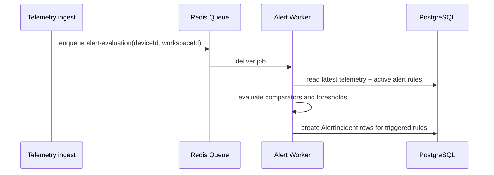
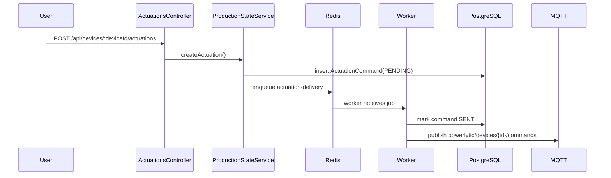

# Request and Event Flows

This document captures the main synchronous and asynchronous flows.

## 1. Human Login and API Access

## 2. Device Telemetry Ingest

## 3. Config Deployment

## 4. Alert Evaluation

## 5. Actuation Flow

## 6. Legacy Compatibility Flow

The API keeps firmware-facing legacy aliases:

- `POST /api/values/devices/:deviceId` (telemetry)
- `GET /api/device/:id/config`
- `POST /api/device/:id/deploy`
- `GET /api/device/:id/deployment-status`
- `PUT /api/device/:id/deployment-status`

These route to the same underlying state services as canonical endpoints.
