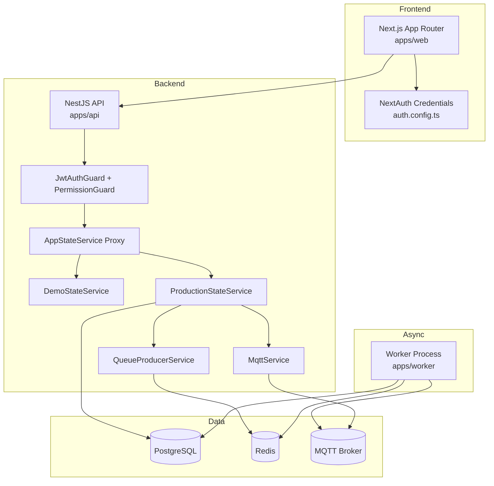

# System Overview

This document explains the code-level architecture and where each responsibility lives.

## 1. Context

Powerlytics is split into three runtime processes:

- Web app (`apps/web`)
- API (`apps/api`)
- Worker (`apps/worker`)

## 2. Component Architecture

## 3. API Internals

### Bootstrapping

- `apps/api/src/main.ts`
  - Sets global prefix `/api`
  - Enables `helmet`
  - Enables CORS using `WEB_ORIGIN`
  - Exposes Swagger at `/api/docs`

- `apps/api/src/app.module.ts`
  - Registers all domain controllers
  - Installs global guards:
    - `JwtAuthGuard`
    - `PermissionGuard`
  - Installs request context middleware

### Domain controllers

- `auth`, `users`, `workspaces`, `port-types`, `device-models`, `devices`, `legacy-device`, `telemetry`, `alerts`, `actuations`, `audit`, `health`

### Data mode switch

- `AppStateService` proxies to:
  - `DemoStateService` when `POWERLYTIC_DATA_MODE!=prisma`
  - `ProductionStateService` when `POWERLYTIC_DATA_MODE=prisma`

## 4. Web Internals

- App router pages in `apps/web/app/**`
- Auth/session in `apps/web/auth.config.ts`
- Route protection middleware in `apps/web/middleware.ts`
- Server-side API helper in `apps/web/lib/api.ts`
- Client-side helper in `apps/web/lib/client-api.ts`

## 5. Worker Internals

`apps/worker/src/main.ts` creates 3 workers:

- `config-deployments`
- `alert-evaluation`
- `actuation-delivery`

Each worker pulls from Redis, updates PostgreSQL, and may publish to MQTT/HTTP bridge.

## 6. Storage and Messaging

- Relational data: PostgreSQL via Prisma
- Queue/event backbone: Redis + BullMQ
- Device publish channel: MQTT
- Optional direct HTTP bridge: `CONFIG_BRIDGE_URL`

## 7. Why This Shape

- Web and API are separated for clean auth/session and API contract boundaries.
- Worker decouples background workloads from HTTP latency.
- Prisma gives strong type-safety and migration discipline.
- Redis/BullMQ adds retry/backoff for unreliable external systems.
- MQTT supports low-latency fanout for device command/config delivery.
