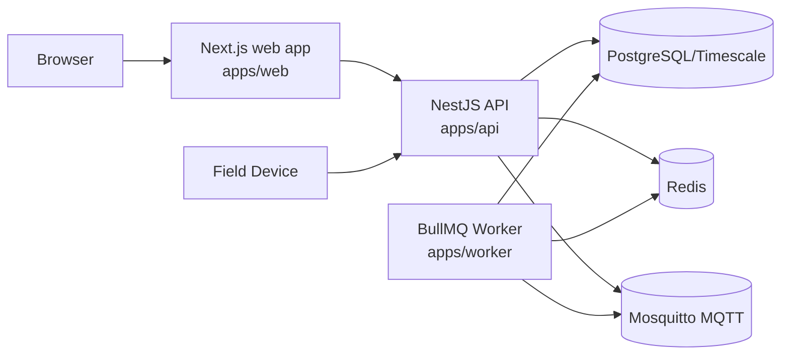
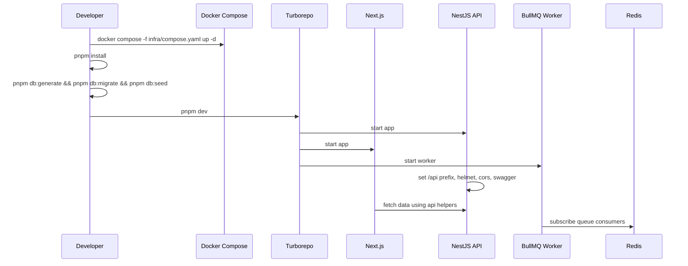

# New Developer Guide

This guide explains the repository as it exists today, so you can run it, navigate it, and safely extend it.

## 1. What This Repository Is

Powerlytics is a Turborepo monorepo for an industrial IoT platform with:

- A web dashboard for human users
- A REST API for users/devices/integrations
- A background worker for queue jobs
- Shared packages for authz/types/validation/database

## 2. Monorepo Layout

```text
apps/
  api/      NestJS API
  web/      Next.js App Router frontend
  worker/   BullMQ workers
packages/
  authz/     role->permission rules
  db/        Prisma schema/migrations/seed
  types/     shared enums/contracts
  validators/ shared zod schemas
  ui/        shared UI exports
  config/    shared lint config
infra/
  compose.yaml
  docker/
    init-timescale.sql
    mosquitto.conf
docs/
  onboarding/
  architecture/
  api/
  operations/
  migration/
```

## 3. Runtime Architecture



## 4. Technology Map (Why, How, Where)

| Technology | Why it exists | How it works here | Primary files |
| --- | --- | --- | --- |
| TypeScript | Type-safe backend/frontend/shared contracts | All apps/packages are TS projects with per-package tsconfig | `tsconfig.base.json`, `apps/*/tsconfig.json`, `packages/*/tsconfig.json` |
| pnpm workspaces | Manage monorepo dependencies efficiently | Root workspace with package filters per app/package | `pnpm-workspace.yaml`, `package.json` |
| Turborepo | Orchestrate `dev/build/test/lint/typecheck` across workspace | Pipelines and task graph run app scripts in parallel | `turbo.json`, root `package.json` scripts |
| NestJS | Structured modular API with guards/controllers/services | Global auth + permission guards; controller-driven REST | `apps/api/src/app.module.ts`, `apps/api/src/main.ts` |
| Next.js 15 (App Router) | Server-rendered dashboard and route-level UI | App router pages fetch API via server helpers | `apps/web/app/**`, `apps/web/lib/api.ts` |
| NextAuth (Credentials + JWT session) | Web login/session lifecycle | Validates email/password against Prisma, injects API JWT into session | `apps/web/auth.config.ts`, `apps/web/app/api/auth/[...nextauth]/route.ts`, `apps/web/middleware.ts` |
| React Query | Client-side async state/caching foundation for interactive pages | Hook layer under `lib/hooks` for API-driven UI interactions | `apps/web/lib/hooks/**`, `apps/web/package.json` |
| Tailwind CSS | Utility-first styling for dashboard UI | Tailwind configured for App Router components | `apps/web/tailwind.config.ts`, `apps/web/app/globals.css` |
| Prisma | Typed DB access and schema migrations | API and web auth adapter share same PostgreSQL schema | `packages/db/prisma/schema.prisma`, `apps/api/src/prisma/prisma.service.ts` |
| PostgreSQL/Timescale | Persistent domain data + time-series-ready backend | Main relational storage; telemetry currently stored in relational table | `infra/compose.yaml`, `packages/db/prisma/schema.prisma`, `infra/docker/init-timescale.sql` |
| Redis | Queue backend for asynchronous jobs | BullMQ queues for config deploy/alerts/actuation | `apps/api/src/queues/queue-producer.service.ts`, `apps/worker/src/main.ts` |
| BullMQ | Background processing and retry semantics | API enqueues jobs, worker consumes them | `apps/api/src/queues/queue-producer.service.ts`, `apps/worker/src/main.ts` |
| MQTT | Device-facing async command/config publish path | API and worker can publish JSON payloads to device topics | `apps/api/src/realtime/mqtt.service.ts`, `apps/worker/src/main.ts` |
| Zod validators | Input shape validation at controller boundaries | Request bodies parsed via schemas before service calls | `packages/validators/src/index.ts`, controllers in `apps/api/src/**` |
| Shared RBAC package | Single source for permission matrix | Permission guard checks route metadata against role permissions | `packages/authz/src/index.ts`, `apps/api/src/authorization/permission.guard.ts` |
| Docker Compose | Local infra bootstrap | Starts postgres, redis, mosquitto for local development | `infra/compose.yaml` |
| Helmet + CORS + Swagger | API hardening and discoverability | Security headers, configurable web origin, generated docs | `apps/api/src/main.ts` |
| Vitest + ESLint | Test and code quality baseline | Package-level test/lint scripts run through turbo | `apps/api/package.json`, `packages/validators/package.json`, `packages/authz/package.json`, `packages/config/eslint.config.mjs` |

## 5. API Data Mode: Demo vs Prisma

The API uses a mode switch:

- `POWERLYTIC_DATA_MODE=demo`: in-memory state (`DemoStateService`)
- `POWERLYTIC_DATA_MODE=prisma`: database-backed state (`ProductionStateService`)

The switch is implemented by a proxy service:

- `apps/api/src/common/app-state.service.ts`

## 6. Authentication and Authorization at a Glance

### Human auth flow

1. User signs in on `/login`.
2. NextAuth validates credentials against `User.password` in DB.
3. NextAuth signs an API bearer token (JWT) containing user/workspace claims.
4. Web sends `Authorization: Bearer ...` + `x-workspace-id` to API.
5. API global guard validates token and workspace membership.

### Device auth flow

1. Device sends `Authorization: Device <secret>` (or `x-device-key`).
2. API hashes secret with `DEVICE_API_KEY_PEPPER`.
3. API matches `DeviceCredential.keyHash`.
4. Request runs as device principal.

### Authorization

- API routes annotate required permissions using `@RequirePermission(...)`.
- `PermissionGuard` maps user roles to permissions using `packages/authz`.
- Device principals are allowed only for telemetry ingest permission.

## 7. Ports and URLs

Default local URLs:

- Web: `http://localhost:3000`
- API: `http://localhost:4000/api`
- Swagger: `http://localhost:4000/api/docs`
- Postgres: `localhost:5432`
- Redis: `localhost:6379`
- MQTT: `localhost:1883` (ws: `9001`)

## 8. Startup Process (Local)



## 9. Read Next

- [System Overview](../architecture/system-overview.md)
- [Request Flows](../architecture/request-flows.md)
- [Entity Relationships](../architecture/entity-relationship.md)
- [API Contract](../api/api-contract.md)
- [Runbook](../operations/runbook.md)
